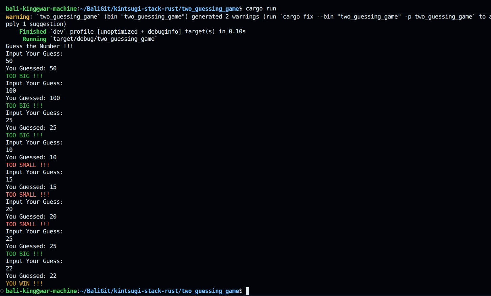
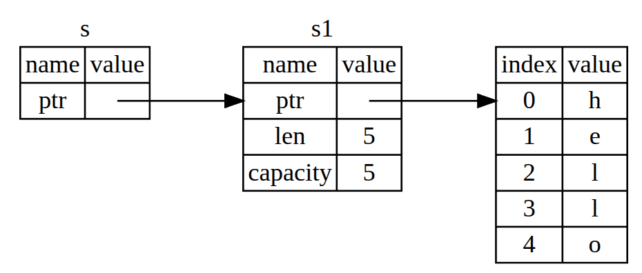

# kintsugi-stack-rust

> "Rust is technology from the past come to save the future from itself." — Graydon Hoare, Creator of Rust

- Author: [Kintsugi-Programmer](https://github.com/kintsugi-programmer)



> Disclaimer: The content presented here is a curated blend of my personal learning journey, experiences, open-source documentation, and invaluable knowledge gained from diverse sources. I do not claim sole ownership over all the material; this is a community-driven effort to learn, share, and grow together.

## Table of Contents
- [kintsugi-stack-rust](#kintsugi-stack-rust)
  - [Table of Contents](#table-of-contents)
- [Rust's Official Documentation's Codes](#rusts-official-documentations-codes)
  - [1. Getting Started](#1-getting-started)
    - [1.1. Installation](#11-installation)
    - [1.2. Hello, World!](#12-hello-world)
    - [1.3. Hello, Cargo!](#13-hello-cargo)
  - [2. Programming a Guessing Game](#2-programming-a-guessing-game)
  - [3. Common Programming Concepts](#3-common-programming-concepts)
    - [3.1. Variables and Mutability](#31-variables-and-mutability)
    - [3.2. Data Types](#32-data-types)
    - [3.3. Functions](#33-functions)
    - [3.4. Comments](#34-comments)
    - [3.5. Control Flow](#35-control-flow)
  - [4. Understanding Ownership](#4-understanding-ownership)
    - [4.1. What Is Ownership?](#41-what-is-ownership)
    - [4.2. References and Borrowing](#42-references-and-borrowing)
    - [4.3. The Slice Type](#43-the-slice-type)
  - [5. Using Structs to Structure Related Data](#5-using-structs-to-structure-related-data)
    - [5.1. Defining and Instantiating Structs](#51-defining-and-instantiating-structs)
    - [5.2. An Example Program Using Structs](#52-an-example-program-using-structs)
    - [5.3. Methods](#53-methods)
  - [6. Enums and Pattern Matching](#6-enums-and-pattern-matching)
    - [6.1. Defining an Enum](#61-defining-an-enum)
    - [6.2. The match Control Flow Construct](#62-the-match-control-flow-construct)
    - [6.3. Concise Control Flow with if let and let else](#63-concise-control-flow-with-if-let-and-let-else)
  - [7. Packages, Crates, and Modules](#7-packages-crates-and-modules)
  - [8. Common Collections](#8-common-collections)
  - [9. Error Handling](#9-error-handling)


---

# Rust's Official Documentation's Codes

## 1. Getting Started

**SERIES OVERVIEW**

- This is a chapter-by-chapter series covering the Rust Programming Language book (also known as "the book")
- parent doc: https://doc.rust-lang.org/stable/
- "the book"(The Rust Programming Language): https://doc.rust-lang.org/stable/book/
- The Rust Standard Library: https://doc.rust-lang.org/stable/std/

### 1.1. Installation

```bash
sudo apt update
sudo apt install -y curl
curl --proto '=https' --tlsv1.2 -sSf https://sh.rustup.rs | sh
```

- Rust Lang: Rust Install https://doc.rust-lang.org/book/ch01-01-installation.html
  - Windows
    - Install Linux, Just kidding !!
    - https://visualstudio.microsoft.com/downloads/
      - Install VS
      - Install VSC
      - Install Build Tools for Visual Studio
        - then Restart Computer
    - https://rust-lang.org/tools/install/
      - Install Rust
    - `rustup toolchain install stable-x86_64-pc-windows-gnu`
    - `rustup default stable-x86_64-pc-windows-gnu`
  - Linux: `$ curl --proto '=https' --tlsv1.2 https://sh.rustup.rs -sSf | sh`
- Rust Server Dev: Rust Analyzer Install https://marketplace.visualstudio.com/items?itemName=rust-lang.rust-analyzer

---

**INSTALLING RUST**

**For Linux and macOS:**

- Installation command to copy and paste into terminal:

```bash
curl --proto '=https' --tlsv1.2 -sSf https://sh.rustup.rs | sh
```

- After running this command, you should see text confirming "Rust is installed now"
- Important: After installation, reload your terminal so the paths are updated

**For Windows:**

- Installation steps are different but fairly simple
- Refer to the Rust book for specific Windows installation instructions

**INSTALLING RUST LANGUAGE SERVER**

**Purpose of Language Server:**

- Provides code completion
- Enables go-to-definition functionality
- Offers refactoring abilities

**For Visual Studio Code Users:**

- Open the Extensions tab
- Search for "rust"
- You'll see two main options:
  - First result: Official Rust programming language extension (being deprecated - don't install this one)
  - **Second result: rust-analyzer (install this one)**
- After installation, you may get a pop-up saying "the language server for Rust is not yet installed" - go ahead and download it
- You might see an error "rust analyzer failed to discover workspace" - this is normal when not using Cargo, can be ignored

### 1.2. Hello, World!

```rs
// 1_2_hello_world.rs
fn main(){
    println!("Hello, World! ")
}
// rustc main.rs && ./main
```

---

**WRITING YOUR FIRST RUST PROGRAM**

**Setup:**

- Create a new directory called `hello_world`
- Navigate into it using `cd hello_world`
- Open it in VS Code

**Creating the File:**

- Create a new file named `main.rs`
- The `.rs` extension is for Rust files

**The Code:**

```rust
// 1_2_hello_world.rs
fn main(){
    println!("Hello, World! ")
}
// rustc main.rs && ./main
```

**Code Breakdown:**

- `fn main()` - This is the main function that executes when your program starts
- `println!` - This is a macro (you'll learn about macros later)
- The text in quotes can be anything you want (traditionally "Hello, World!" but this example uses "Let's get rusty")
- Don't forget the semicolon at the end

**Compiling and Running:**

- Save your work
- Go to terminal
- Compile using: `rustc main.rs`
- This creates a new executable file called `main`
- Run the executable: `./main` (on Linux/macOS) or `main.exe` (on Windows)
- Output should display your message

### 1.3. Hello, Cargo!

```bash
cargo --version # cargo version check
&& cargo new project_name # create proj.
&& cd project_name
&& cargo build # build executable
&& cargo run # run project
&& cargo check # check for err without any executable
&& cargo help # help

# .
# ├── Cargo.lock
# ├── Cargo.toml
# └── src
#     └── main.rs

# .
# ├── Cargo.lock
# ├── Cargo.toml
# ├── src
# │   └── main.rs
# └── target
#     ├── CACHEDIR.TAG
#     └── debug
#         ├── build
#         ├── deps
#         │   ├── libone_three_hello_cargo-f9884884092cd48a.rmeta
#         │   ├── one_three_hello_cargo-5885dd703046e3fc
#         │   ├── one_three_hello_cargo-5885dd703046e3fc.d
#         │   └── one_three_hello_cargo-f9884884092cd48a.d
#         ├── examples
#         ├── incremental
#         │   ├── one_three_hello_cargo-10ah7hvrv4gzi
#         │   │   ├── s-heho9i1rut-1ysdico-bwbrfy6ptxbomf5iwqz5vt3f0
#         │   │   │   ├── dep-graph.bin
#         │   │   │   ├── query-cache.bin
#         │   │   │   └── work-products.bin
#         │   │   └── s-heho9i1rut-1ysdico.lock
#         │   └── one_three_hello_cargo-3dgwin0zbxstr
#         │       ├── s-heho98ij63-039vdoh-143bk3qfw5zxnyx5otl9s0tja
#         │       │   ├── 00ylhni9avwle6wyqpyzm6par.o
#         │       │   ├── 19k6gm7hj98zo0jv2b5mu1std.o
#         │       │   ├── 1jqdhkz0e02p777bbobcmna2j.o
#         │       │   ├── 5fgvfmdk1vtvncsc4ze5a0wi9.o
#         │       │   ├── 8z1o97dthkm4wl9qy6anckmmy.o
#         │       │   ├── 9fwica1fdmiqw5oux5l4cedjc.o
#         │       │   ├── dep-graph.bin
#         │       │   ├── query-cache.bin
#         │       │   └── work-products.bin
#         │       └── s-heho98ij63-039vdoh.lock
#         ├── one_three_hello_cargo
#         └── one_three_hello_cargo.d
```

---

**INTRODUCTION TO CARGO**

**What is Cargo:**

- Cargo is Rust's build system and package manager
- Comes built-in with Rust installation
- Handles projects with multiple files and dependencies
- This is a pain point with other low-level programming languages, but Rust has it built-in

**Verifying Cargo Installation:**

```bash
cargo --version
```

- Should show something like: `cargo 1.49.0` (version numbers will vary)

**CREATING A PROJECT WITH CARGO**

**Creating a New Project:**

```bash
cargo new hello_cargo
```

- This command creates a new package
- Cargo automatically initializes a Git repository for the project
- You can use a different source control system by specifying it during creation

**Project Structure:**

**1. Cargo.toml File:**

- This is the configuration file for your package
- Similar to `package.json` in the web development world
- Contains:
  - Package name
  - Version number
  - Edition information
  - Dependencies section (currently empty, but any dependencies would be listed here)

**2. .gitignore File:**

- Created because Cargo automatically initializes a Git repo

**3. src/ Directory:**

- Contains your actual code
- Includes a `main.rs` file automatically generated with a hello world program

**BUILDING AND RUNNING CARGO PROJECTS**

**Building the Project:**

```bash
cd hello_cargo
cargo build
```

**What Happens:**

- Creates a new file called `Cargo.lock`
  - Specifies exact dependencies
  - Currently sparse because there are no dependencies
- Creates a `target/` directory
  - Contains a `debug/` directory
  - Includes the actual executable
  - Plus other build artifacts

**Running the Project:**

```bash
cargo run
```

- This command both builds and runs your program
- Output: Displays "Hello, World!" (or whatever message is in your code)

**OTHER USEFUL CARGO COMMANDS**

**Checking for Errors:**

```bash
cargo check
```

- Checks your program for errors without producing an executable
- Much faster than building because it doesn't create the executable
- Useful during development

**Viewing All Commands:**

```bash
cargo help
```

- Shows all available Cargo commands


```bash
bali-king@war-machine:~/BaliGit/kintsugi-stack-rust/one_three_hello_cargo$ cargo run
   Compiling one_three_hello_cargo v0.1.0 (/home/bali-king/BaliGit/kintsugi-stack-rust/one_three_hello_cargo)
    Finished `dev` profile [unoptimized + debuginfo] target(s) in 0.10s
     Running `target/debug/one_three_hello_cargo`
Hello, world!
bali-king@war-machine:~/BaliGit/kintsugi-stack-rust/one_three_hello_cargo$ cargo build
    Finished `dev` profile [unoptimized + debuginfo] target(s) in 0.00s
bali-king@war-machine:~/BaliGit/kintsugi-stack-rust/one_three_hello_cargo$ cargo check
    Checking one_three_hello_cargo v0.1.0 (/home/bali-king/BaliGit/kintsugi-stack-rust/one_three_hello_cargo)
    Finished `dev` profile [unoptimized + debuginfo] target(s) in 0.02s
bali-king@war-machine:~/BaliGit/kintsugi-stack-rust/one_three_hello_cargo$ 
```
```bash
.
├── Cargo.lock
├── Cargo.toml
├── src
│   └── main.rs
└── target
    ├── CACHEDIR.TAG
    └── debug
        ├── build
        ├── deps
        │   ├── libone_three_hello_cargo-f9884884092cd48a.rmeta
        │   ├── one_three_hello_cargo-5885dd703046e3fc
        │   ├── one_three_hello_cargo-5885dd703046e3fc.d
        │   └── one_three_hello_cargo-f9884884092cd48a.d
        ├── examples
        ├── incremental
        │   ├── one_three_hello_cargo-10ah7hvrv4gzi
        │   │   ├── s-heho9i1rut-1ysdico-bwbrfy6ptxbomf5iwqz5vt3f0
        │   │   │   ├── dep-graph.bin
        │   │   │   ├── query-cache.bin
        │   │   │   └── work-products.bin
        │   │   └── s-heho9i1rut-1ysdico.lock
        │   └── one_three_hello_cargo-3dgwin0zbxstr
        │       ├── s-heho98ij63-039vdoh-143bk3qfw5zxnyx5otl9s0tja
        │       │   ├── 00ylhni9avwle6wyqpyzm6par.o
        │       │   ├── 19k6gm7hj98zo0jv2b5mu1std.o
        │       │   ├── 1jqdhkz0e02p777bbobcmna2j.o
        │       │   ├── 5fgvfmdk1vtvncsc4ze5a0wi9.o
        │       │   ├── 8z1o97dthkm4wl9qy6anckmmy.o
        │       │   ├── 9fwica1fdmiqw5oux5l4cedjc.o
        │       │   ├── dep-graph.bin
        │       │   ├── query-cache.bin
        │       │   └── work-products.bin
        │       └── s-heho98ij63-039vdoh.lock
        ├── one_three_hello_cargo
        └── one_three_hello_cargo.d
```

**CHAPTER COMPLETION**

- Chapter 1 of the Rust book is now complete
- Next chapter will cover more advanced topics

## 2. Programming a Guessing Game


```rs
use std::{cmp::Ordering, io}; // io lib in scope 

// Random Library
// to add deps "rand" package => add `deps = "version"` in `Cargo.toml` => cargo build
// [dependencies]
// rand = "0.5.5"
use rand::{Rand, Rng}; 

// colored library
// colored="2.0.0"
use colored::*;

// use `cargo run` or Run Button in Vsc at the main line( comes with extension )
fn main() {
    // intro lines print
    println!("Guess the Number !!!"); // like python/c

    // Now Random Check is Left

    // // Random Library
    // // to add deps "rand" package => add `deps = "version"` in `Cargo.toml` => cargo build
    // // [dependencies]
    // // rand = "0.5.5"
    // use rand::{Rand, Rng}; 
    let secret_nos = rand::thread_rng().gen_range(1,101); // lower limit is inclusive, upper limit is exclusive 
    // println!("Actual Number: {}", secret_nos);


    // to make game more interesting we can have game on loop to guess till user guess the number correctly
    loop {

    println!("Input Your Guess:");

    // variable to store stuff
    // String, A type is Rust Standard library, utf-8, growable string
    // new() is associative func. static method, create empty string
    // Variables in Rust are DEFAULT IMMUTABLE, to make them mutable, use mut keyword
    let mut guess = String::new(); // like java

    // io lib in scope 
    // use std::io; // io lib in scope 
    // .read_line method to read line
    // Result cases to 1. Ok() & 2. Err()
    io::stdin() // like java
        .read_line(&mut guess) 
        .expect("Failed to Read Line"); // iff err comes, .expect() crash program, and display message
        
    // Shadowing, we declare one variable (let mut guess = String::new();) and then redeclare to convert the datatype but to preserve the value
    // .trim() remove whitespaces
    // .parse() helps to parse
    // let guess: u32 = guess.trim().parse().expect("Failed to Read Line");// error handling strict by language // old way
    let guess: u32 = match guess.trim().parse(){
        Ok(num)=> num,
        Err(_)=> continue // `_` means catch all
        // to whatever any wrong input comes, continue the loop 
    };// new way

    println!("You Guessed: {}",guess); // like c
    // Guess the Number !!!
    // Input Your Guess:
    // 12
    // You Guessed: 12

    // cmp::Ordering library
    // match guess.cmp(&secret_nos){
    //     Ordering::Equal => {print!("YOU WIN !!!");break;},// to terminate after win is to break the loop // New way
    //     // Ordering::Equal => print!("YOU WIN !!!"), // Old way
    //     Ordering::Less => print!("TOO SMALL !!!"),
    //     Ordering::Greater => print!("TOO BIG !!!")
    // } // Old way no color

    // New Way, Color-ed :)
    match guess.cmp(&secret_nos){
    Ordering::Equal => {
        print!("{}","YOU WIN !!!".yellow());
        println!();// newline cosmetic code
        break;
    },
    Ordering::Less => print!("{}","TOO SMALL !!!".red()),
    Ordering::Greater => print!("{}","TOO BIG !!!".green())
    } 

    println!();// newline cosmetic code

    // basic working
    // Guess the Number !!!
    // Input Your Guess:
    // 2
    // You Guessed: 2
    // Actual Number: 2
    // YOU WIN !!!

    }
    
}

```

---

**Project Overview**
- Building a fully functional AAA-rated guessing game
- Includes additional features not covered in the original book
- Previous chapter covered Hello World program (Chapter 1)

**Setting Up the Project**

**Initial Project Creation**
- Open terminal
- Run command: `cargo new guessing_game`
- Navigate into directory: `cd guessing_game`
- Open project in VS Code
- Standard Hello World program is generated by default

**Running the Program**
- Method 1: Type `cargo run` in terminal
- Method 2: Use VS Code button (if language server installed)
  - Language server provides a neat button to run programs directly in VS Code

**Building the Basic Game Structure**

**Step 1: Prompting User for Input**
- Change the print statement from "Hello World" to prompt users to input a number
- Use print statement to display the prompt message

**Step 2: Creating Variables to Store Input**
- Use the `let` keyword to create variables in Rust
- Create a variable named `guess`
- Set it equal to a String

**Understanding String Type**
- **String** is a type in Rust's standard library
- It's a UTF-8 encoded growable string
- More details on strings covered in later chapters

**String Creation Syntax**
- Use `String::new()` syntax
- **new** is a function on the String type
- It's an **associative function** (called static methods in other languages)
- **new** returns an empty string that can be used

**Rust's Type Inference**
- Rust is smart enough to realize variable `guess` is of type String
- No need for explicit type annotation
- Rust knows the `new` function returns a String

**Variable Mutability**
- Variables in Rust are **immutable by default**
- Need to change `guess` to capture user input
- Use the **mut** keyword to make variables mutable
- Syntax: `let mut guess = String::new();`

**Step 3: Bringing IO Library into Scope**
- Need the **io** library to capture user input
- Bring library into scope using **use** statement
- Syntax: `use std::io;`
  - **std** = standard library
  - **io** = input/output library

**Step 4: Capturing User Input**
- Use the io library: `io::stdin()`
- **stdin** function gives a handle to standard input of current process
- **read_line** takes user's input and appends it to specified buffer
- In this case, the buffer is the `guess` string

**Understanding read_line Function**
- Takes a **mutable reference** to String
- References covered in later chapters
- Essentially: takes a reference to String, modifies it without taking ownership
- Syntax: Pass in `&mut guess`

**Understanding Result Type**
- **read_line** returns a **Result** type
- Result is an **enumeration** (enum)
- Can return two variants:
  - **Ok**: holds the return value
  - **Err**: holds an error object
- Forces developers to handle error cases

**Error Handling with expect**
- Use the **expect** function for error handling
- If **Ok** variant returned: expect returns the value contained in Ok
- If **Err** variant returned: program panics with provided message
- Example message: "failed to read line"
- In this instance, errors are likely system errors

**Step 5: Printing User Input**
- Use `println!` statement
- Use **curly brackets** `{}` as placeholders for variables
- Syntax: `println!("You guessed: {}", guess);`
- Curly brackets are replaced with the guest string value

**Testing the Program So Far**
- Run command: `cargo run`
- Program prompts for input
- Type in a number (example: 22)
- Press Enter
- Output shows: "You guessed: 22"

**Current functionality achieved:**
- Prompted user for input
- Captured the input
- Printed it back out

**Adding Random Number Generation**

**Why External Dependency Needed**
- Rust's standard library doesn't include random number generation
- Need to add a new dependency

**Adding the rand Dependency**
- Open `Cargo.toml` file
- Under **dependencies** section, add: `rand` with version number
- Save the file
- Run `cargo build`
- This downloads **rand** and its dependencies

**Using the rand Dependency**

**Bringing rand into Scope**
- Go back to `main.rs`
- Add another **use** statement
- Bring the **Rng trait** into scope
- Syntax: `use rand::Rng;`

**Understanding Rng Trait**
- **Rng trait** defines methods that random number generators use
- Must bring it into scope to use random number functionality
- Traits covered in detail in later chapters

**Generating Random Number**
- Create new variable using `let` keyword
- Variable name: `secret_number`
- Syntax: `let secret_number = rand::thread_rng().gen_range(1..101);`

**Understanding Random Number Functions**
- **thread_rng**: associative function that gives a random number generator
- **gen_range**: method that produces a random number within specified range
- Range: 1 to 101 (high value is exclusive, so actual range is 1-100)

**Printing the Secret Number**
- Use `println!` with curly brackets
- Syntax: `println!("The secret number is: {}", secret_number);`
- This is for testing purposes

**Testing Random Number Generation**
- Run: `cargo run`
- First run shows: 72
- Run again: shows different number (81)
- Confirms random number generation works

**Comparing User Guess with Secret Number**

**Bringing Ordering into Scope**
- Need to bring **Ordering** into scope
- **Ordering** is an enum that represents result of comparing two things
- Three variants:
  - **Less**: first value is less than second
  - **Greater**: first value is greater than second
  - **Equal**: values are equal

**Using the cmp Method**
- Scroll to end of program
- Use `guess.cmp(&secret_number)`
- **cmp** takes a reference to the thing being compared (secret_number)
- **cmp** returns an **Ordering** enum (Less, Greater, or Equal)

**Handling Different Outcomes with Match Expression**
- Need to print different strings depending on Ordering variant returned
- Rust uses **match expressions** for this

**Creating Match Expression**
- Put the word **match** in front of the statement
- Add curly brackets after the statement
- Match all possible return values:
  - `Ordering::Less => println!("Too small!")`
  - `Ordering::Greater => println!("Too big!")`
  - `Ordering::Equal => println!("You win!")`

**Type Mismatch Error**
- Red squiggly lines appear after saving
- Error: can't compare type String to type integer
- **secret_number** is an integer
- **guess** is a String
- Need to convert String to integer

**Converting String to Integer**

**Shadowing Variables**
- Create a new `guess` variable right after getting user input
- Take the first `guess` variable (String) and convert it

**Conversion Process**
- Call **trim** on the string
  - **trim** removes whitespace at beginning or end of line
- Call **parse** function
  - **parse** converts string into another type
  - Parse doesn't know what type to convert to automatically

**Type Annotation**
- Annotate the variable to give parse a hint
- Syntax: `let guess: u32`
- **u32** = unsigned 32-bit integer

**Handling Parse Errors**
- **parse** function can fail
- Returns a **Result** type (parsed value or error)
- Use **expect** function with error message
- If parse fails, user probably didn't type a number
- Message: "Please type a number!"

**Result of Conversion**
- Red squiggly lines disappear
- Comparison logic at end of program is now valid

**Testing Comparison Logic**
- Run: `cargo run`
- Example 1: Secret is 47, guess 46 → "Too small!"
- Example 2: Secret is 75, guess 76 → "Too big!"
- Example 3: Secret is 50, guess 50 → "You win!"
- Comparison logic works correctly

**About Shadowing**
- Declared `guess` as String type
- Later redeclared `guess` as u32 type
- This is called **shadowing**
- Often used to convert a variable from one type to another while preserving same name
- More details covered in Chapter 3

**Adding Loop for Multiple Guesses**

**Current Problem**
- If user guesses wrong, program tells them too small/too big and quits
- Want users to keep guessing until they get correct number

**Implementing Loop**
- Add **loop** keyword before prompting user for input
- Put everything underneath inside the loop
- Syntax: `loop { ... }`

**Testing the Loop**
- Run: `cargo run`
- Secret number: 70
- Guess 50 → "Too small!" → can guess again
- Guess 70 → "You win!" → but game continues
- Can type 70 again → says won again
- Loop never ends because nothing tells it to stop

**Problem with Invalid Input**
- Type "quit" → program panics (not a number)
- Any non-number input causes panic and program exits

**Adding Break Statement**
- Go to match statement
- Modify the Equal arm
- Not only print "You win!" but also **break** out of loop
- Syntax: `Ordering::Equal => { println!("You win!"); break; }`

**Testing Break Statement**
- Run: `cargo run`
- Secret: 43
- Guess 42 → "Too small!"
- Guess 43 → "You win!" → program exits as expected

**Improving Invalid Input Handling**

**Current Behavior**
- Run program and type random string → panic and exit
- Not ideal user experience

**Desired Behavior**
- Keep prompting user to input a number until it's valid
- Don't exit program on invalid input

**Modifying Error Handling**
- Modify the line that panics if parse fails
- **parse** returns Result enum (Ok or Err)
- Can use **match expression** to handle both cases

**Implementing Match for Parse Result**
- Include **match** keyword at beginning of line
- Instead of calling expect, use curly brackets
- Handle both variants:
  - **Ok(num)**: wraps output (u32 integer) → return it
  - **Err(_)**: catch-all value using underscore → continue to next loop iteration

**Match Expression Structure**
```rust
let guess: u32 = match guess.trim().parse() {
    Ok(num) => num,
    Err(_) => continue,
};
```

**Understanding the Catch-All Pattern**
- Underscore `_` is a catch-all value
- Means: no matter what error we get, execute same action
- Action: **continue** to next iteration of loop

**Testing Invalid Input Handling**
- Run program
- Give invalid input (random string)
- Program keeps asking to enter guess
- Only accepts valid numbers
- Program is now fully functional

**Adding Color Enhancement**

**Purpose**
- Make game better with colored text
- Not in original book
- Too small/too big → red text
- Correct guess → green text

**Adding colored Dependency**
- Go back to `Cargo.toml` file
- Add new dependency: `colored`
- Save file
- Run `cargo build`

**Using the colored Library**
- Go back to `main.rs`
- Scroll to top
- Bring color library into scope
- Syntax: `use colored::*;`

**Modifying Print Statements**
- Scroll down to comparison logic
- Use curly brackets with color methods

**For Red Text (Too Small/Too Big)**
- Call `.red()` on text to be displayed in red
- Example: `println!("Too small! {}", "".red());`
- Modify print statements for both "Too small!" and "Too big!"

**For Green Text (You Win)**
- Call `.green()` on text
- Example: `println!("{}", "You win!".green());`

**Testing Colored Output**
- Run: `cargo run`
- Secret: 39
- Guess 38 → red text for "Too small!"
- Guess 39 → green text for "You win!"

**Final Program Statistics**
- Under 40 lines of code
- Fully functional guessing game
- Includes color enhancement

**Concepts Learned in Chapter 2**

**Variables**
- Creating variables with `let` keyword
- Mutable vs immutable variables
- Shadowing variables

**Match Statement**
- Handling multiple possible outcomes
- Matching enum variants
- Using catch-all patterns with underscore

**Methods**
- Calling methods on types
- Examples: trim(), parse(), cmp()

**Associative Functions**
- Functions associated with types
- Called using `::` syntax
- Examples: String::new(), rand::thread_rng()

**Using External Crates**
- Adding dependencies in Cargo.toml
- Bringing libraries into scope with `use`
- Examples: rand, colored

**Error Handling**
- Result type and its variants (Ok, Err)
- Using expect() for simple error handling
- Using match expressions for custom error handling

**Loops**
- Creating infinite loops with `loop`
- Breaking out of loops with `break`
- Continuing to next iteration with `continue`

**Type System**
- Type inference
- Type annotations
- Type conversion with parse()

**Call to Action**
- Give video a like if enjoyed
- Subscribe for more Rust content
- Hit notification bell for new video alerts
- Next video will cover next chapter

**Program Structure Summary**

**Complete Flow:**
- Set up Cargo project
- Import necessary libraries (io, rand, colored)
- Generate random secret number (1-100)
- Loop starts:
  - Prompt user for guess
  - Read user input as String
  - Convert String to u32 (with error handling)
  - Compare guess with secret number
  - Print result in appropriate color:
    - Red if too small or too big
    - Green if correct
  - Break loop if correct
  - Continue loop if incorrect or invalid input
- End program when correct guess is made

## 3. Common Programming Concepts

Topics Covered: Variables, Basic Types, Functions, Control Flow, Comments

### 3.1. Variables and Mutability

```rs
// use std::io;
fn main(){
    // Variables and Mutability

    // Vars in Rust are immutable by default 
    // also will throw warning as it's never used in code
    // warning: unused variable: `val1`
    let val1 = 10; 
    
    // you cannot re-assign immutable entity
    // error[E0384]: cannot assign twice to immutable variable `val1`
    // val1 = 20; // No
    
    // Mutable Variable, just by declare `mut` during initialization 
    // also will throw warning as it's(this assignment) never used in code( even thou we used it to print, but print uses the 2nd assigned value, not 1st )
    // warning: value assigned to `val2` is never read
    let mut val2 = 20; 

    // Re-assigned Successfully 
    // also not throw warning as we use this assignment (i.e. 2nd) to println
    val2 = 30; 
    println!("{}",val2);
    // 30

    // unused variable warning fix
    // if this is intentional, prefix it with an underscore: `_val1`
    let _val3 = 10;

    // Constants 
    // Contant values
    
    // - Constant naming convention: 
    //  - ALL CAPS
    //  - underscores(_) replacing spaces( ) 
    // eg: "Fixed value"(normal word intention) -> FIXED_VALUE" (Constant Name)
    const FIXED_VALUE: u32 = 1;// YES
    
    // can't use `mut` keyword in constants
    // error: const globals cannot be mutable
    // const mut FIXED_VALUE =1; // No

    // must be datatype annotated
    // error: missing type for `const` item, help: provide a type for the constant
    // const FIXED_VALUE =1; // No

    // numeric literals readability feature  
    // while storing numbers, we can use underscores as commas for readability
    // eg: 1000 = 1___000 = 10_00__  at rust 
    // eg: _1000 is wrong at rust 
    // purpoes example; eg: 1lakh, 100000, we use commas in english for readability 1,00,000.
    // at rust; to improve readability; 100000 = 1_00_000
    const FIXED_VALUE_1: u128 = 1_00_000 ;
    println!("{}",FIXED_VALUE_1); // 100000
    
    // constants may be set only to a constant expression
    // , not the result of a value that could only be computed at runtime. 
    const FIXED_VALUE_2: u128 = 1+ FIXED_VALUE_1; // allowed, computation done at compile time
    println!("{}", FIXED_VALUE_2);
    const FIXED_VALUE_3: u128 = 100*20000 + 10; // allowed, computation done at compile time
    println!("{}", FIXED_VALUE_3);

    // error[E0435]: attempt to use a non-constant value in a constant
    // computation done at runtime not allowed at const. assign

    // // example for computation at runtime
    // let mut input:u128 ;
    // io::stdin()
    //     .read_line(&mut input)
    //     .expect("Failed to read input");
    // // const FIXED_VALUE_4: u128 = 1+ input; // NO, not allowed

    // Shadowing
    // Way to create a new variable using existing name
    // helps to preserve mutability and even update the value
    let x =1;// x is immutable,
    // x=2; // NO, error[E0384]: cannot assign twice to immutable variable `x`
    let x=2;// YES, Shadowing, x is still immutable, mutability preserved
    println!("{}",x);// 2
    let x="two";// YES, Shadowing, x is still immutable, mutability preserved, and typecasting
    println!("{}",x);// two
    let x=3;// YES, Shadowing, x is still immutable, mutability preserved
    println!("{}",x);// 3

    // purpoes example: to typecast data
    let x = x.to_string(); // Shadowing to Typecast int -> string
    println!("{}",x);// 3
    
    // clone()
    // we can't use x as x is chaged as string ops. 
    // so we use copy of x to play with it
    // println!("{}",x+"10");// 310 // NO, it will work at this line, after this line if used somewhere it will throw error, error[E0382]: borrow of moved value: `x`
    println!("{}",x.clone()+"10");// 310 // YES
    
}
```

---

VARIABLES AND MUTABILITY

**Variables are Immutable by Default**

- In Rust, when you create a variable, it cannot be changed unless explicitly made mutable
- This is a core safety feature of Rust

Example of Immutable Variable Error:

```rust
let x = 5;
println!("{}", x);
x = 6;  // ERROR: cannot assign twice to immutable variable
println!("{}", x);
```

Error message: "cannot assign twice to an immutable variable"


**Making Variables Mutable**

- To allow a variable to be changed, use the `mut` keyword after `let`
- This explicitly declares that the variable can be reassigned

Correct syntax:

```rust
let mut x = 5;
println!("{}", x);  // prints 5
x = 6;
println!("{}", x);  // prints 6
```

Running this with `cargo run` will print:
- First line: 5
- Second line: 6

**Constants**

- Constants are values that can NEVER change
- Created using the `const` keyword instead of `let`
- Constants have several requirements and differences from variables

Syntax example:

```rust
const SUBSCRIBER_COUNT: u32 = 100_000;
```

**Key Differences Between Constants and Variables:**

1. **Cannot be mutable**
   - You cannot use `mut` with constants
   - Typing `mut` before a constant gives error: "const globals cannot be mutable"
   - If you declare a constant, you can be absolutely sure it will never be mutated

2. **Must have type annotation**
   - Variables can have inferred types (like `x` being inferred as i32)
   - Constants MUST have their type explicitly specified
   - In the example: `u32` means unsigned 32-bit integer

3. **Can only be set to constant expressions**
   - Variables can be set to return values of functions
   - Constants CANNOT be set to function return values
   - Constants cannot be set to any value computed at runtime
   - Must be compile-time constant values

4. **Naming convention**
   - Common practice: all uppercase letters
   - Use underscores where there would be spaces
   - Example: `SUBSCRIBER_COUNT`

5. **Numeric literal readability**
   - Large numbers can be hard to read (like 100000)
   - Rust allows underscores in numeric literals for readability
   - Example: `100_000` is much easier to read than `100000`


**Shadowing**

- Shadowing allows you to create a new variable using an existing variable name
- The first variable is "shadowed" by the second variable
- This is different from mutability

Example:

```rust
let x = 5;
let x = 6;  // This shadows the first x
```

**Two Major Advantages of Shadowing:**

1. **Preserves Immutability**
   - The first `x` is still immutable
   - The second `x` is also immutable
   - No `mut` keyword needed
   - Both variables remain immutable despite the reassignment

2. **Can Change Types**
   - You can change the type when shadowing
   - This is NOT possible with mutable variables

Example with type change:

```rust
let x = 5;           // x is an integer
let x = "6";         // x is now a string
println!("{}", x);   // prints "5"
println!("{}", x);   // prints "6" (as string)
```

Running this program:
- First x prints: 5 (integer)
- Second x prints: "6" (string)

- Keywords
  - set of keywords that are reserved for use by the language only, much as in other languages. 
  - Keep in mind that you cannot use these words as names of variables or functions.
  - https://doc.rust-lang.org/stable/book/appendix-01-keywords.html

### 3.2. Data Types

```rs
fn main(){
    // Data Types
    // Scaler datatypes represent single value
    // Compound datatypes represent group of values

    // Scaler datatypes
    // Integers
    // Floating-point numbers
    // Booleans
    // Character

    // Integers
    // numbers without fractional component
    // Signed:      either +ve/-ve integers
    // unsigned:    only +ve integers
    
    // Integer Types in Rust
    // Length	Signed	Unsigned
    // 8-bit	i8	u8
    // 16-bit	i16	u16
    // 32-bit	i32	u32
    // 64-bit	i64	u64
    // 128-bit	i128	u128
    // Architecture-dependent	isize	usize

    // Architecture-dependent: the isize and usize types depend on the architecture of the computer your program is running on: 64 bits if you’re on a 64-bit architecture and 32 bits if you’re on a 32-bit architecture.

    // i32 is default in rust integer datatype

    let a = 98_222; // Decimal
    let b = 0xff; // Hex
    let c = 0o77; // Octal
    let d = 0b1111_0000; // Binary
    let e = b'A'; // Byte ( u8 only )

    // Integer Overflow 
    let f: u8 = 255; // max value of u8
    // let g: u8 = 256; // Integer Overflow
    // at debug build -> Rust Panics (error: literal out of range for `u8`)
    // at release build(compiling in release mode with the --release flag) -> Rust performs 2's Complement Wrapping
    // Rust performs 2's Complement Wrapping => number exceeding max value will wrap around minimum value
    // 256 -> 0+1 -> 1
    // let h: u8 = 260; // 260 -> 0+5 -> 5

    // btw
    // cargo build --release # release flag
    // rustc -O main.rs # optimization flag 

    // Floating-point numbers
    // Decimal values
    let i = 6.8; // default is f64, 64 bit ; double precision floating point number
    let j:f32 = 6.9; // f32
    // The default type is f64 because on modern CPUs, it’s roughly the same speed as f32 but is capable of more precision. 
    // All floating-point types are signed.
    // Floating-point numbers are represented according to the IEEE-754 standard.
    
    // Numeric Operations
    let sum = 5+5333; // Addition
    let div_quotient = 55/2; // Division Quotient
    let div_truncated = -5/3; // Division Truncated
    // Results in -1 
    let remainder = 10%2; // Remainder
    let mul = 55.5 * 100.222; // Multiplication
    let sub = 0.0 - 10.99; // Subtraction

    // Boolean
    // two possible values: true and false.
    // Booleans are one byte in size.
    let k = true;
    let l:bool = false;

    // Character 
    // Rust’s char type is 4 bytes in size
    // Unicode Values
    let c = 'z';
    let z: char = 'ℤ';
    let heart_eyed_cat = '😻';
    
    // Compund Types
    // Represent a group of Values
    // The Tuple Type
    // The Array Type

    // The Tuple Type ()
    // Fixed Size Array
    // Different Datatype Elements
    let tup = ("Hello World",102_00, 1001.11,'😻', true);
    let tup1: (i32, f64, u8) = (500, 6.4, 1);
    // Tuple Access Ways
    // Tuple Access Ways: destructuring & dot notation
    // destructuring way
    let (val1,val2,val3) = tup1;
    // dot notation way
    let val1_1 = tup1.0; 
    // tuple index start from 0
    let val2_1 = tup1.1;
    let val3_1 = tup1.2;

    // The Array Type []
    // Fixed Size Array
    // Same Datatype Elements
    let a = [1,2,3];
    let b = [1.01,2.12212,3.0];
    // let array_out_of_bound_err_exception_eg = b[3]; // NO, index out of bounds
    let months = ["January", "February", "March", "April", "May", "June", "July",
              "August", "September", "October", "November", "December"];
    let curr_month = months[0]; // Array Access
    let a = [-20; 3]; // Array Initialize Multiple at once [Value;Occurences]
    // [-20, -20, -20]

    // Rust Prevents us to do anything Memory Unsafe !!!


}
```

---

DATA TYPES

**Overview**

Rust has two main categories of data types:
1. Scalar data types - represent a single value
2. Compound data types - represent a group of values


SCALAR DATA TYPES

Rust has **four main scalar data types:**
1. Integers
2. Floating-point numbers
3. Booleans
4. Characters


**1. INTEGERS**

- Numbers without a fractional component (whole numbers)
- Every integer has a length and can be signed or unsigned

**Signed vs Unsigned:**
- Signed integers: can be positive OR negative numbers
- Unsigned integers: can ONLY be positive numbers

**Integer Sizes:**
- 8 bits
- 16 bits
- 32 bits
- 64 bits
- 128 bits
- `isize`/`usize`: depends on architecture (usually 64 or 32 bit)

**Default Integer Type:**
- Rust defaults to **signed 32-bit integer** (i32)

**Ways to Represent Integers:**
- Decimal (standard)
- Hexadecimal (hex)
- Octal
- Binary
- Byte

**Integer Overflow:**

Example with 8-bit unsigned integer:

```rust
let x: u8 = 255;  // Max value for u8 is 255
```

What happens if you try to set it to 256 or higher:

- **In debug builds:** Rust will panic (crash with error)
- **In release builds:** Rust performs two's complement wrapping
  - Values greater than maximum wrap around to minimum
  - 256 becomes 0
  - 257 becomes 1
  - And so on

**Language Server Warning:**
- If you have a language server running and try to set `x` to 256
- You'll get an error warning you of the overflow before compilation


**2. FLOATING-POINT NUMBERS**

- Numbers with decimal points
- Support basic numeric operations

**Default Type:**
- 64-bit double precision floating point number (f64)

**Available Operations:**

```rust
// Addition
let sum = 5.0 + 10.0;

// Subtraction
let difference = 95.5 - 4.3;

// Multiplication
let product = 4.0 * 30.0;

// Division
let quotient = 56.7 / 32.2;

// Remainder
let remainder = 43.0 % 5.0;
```


**3. BOOLEANS**

- Represent the values true or false
- Type annotation: `bool`

```rust
let t = true;
let f: bool = false;
```


**4. CHARACTERS**

- Represents a Unicode character
- Written with **single quotes** (not double quotes)
- More details covered in Chapter 8

```rust
let c = 'z';
let heart = '❤';
```


COMPOUND TYPES

**Overview:**
- Types that represent a group of values
- Two main compound types: tuples and arrays


**1. TUPLES**

- Fixed-size collection of related data
- Can contain different types
- Written as comma-separated list inside parentheses

**Creating a Tuple:**

```rust
let tup = ("Let's Get Rusty", 100_000);
```

This tuple contains:
- First value: String representing YouTube channel name
- Second value: Integer representing subscriber count

**Type Annotation (automatic):**
- Types are automatically annotated
- Example type: `(&str, i32)`

**Two Ways to Get Values from Tuples:**

**Method 1: Destructuring**

```rust
let tup = ("Let's Get Rusty", 100_000);
let (channel, sub_count) = tup;
```

How this works:
- Creates new variables inside parentheses: `channel` and `sub_count`
- Sets equal to the tuple
- First variable gets first value from tuple
- Second variable gets second value from tuple

**Method 2: Dot Notation**

```rust
let tup = ("Let's Get Rusty", 100_000);
let sub_count = tup.1;  // Accesses second element
```

Important note:
- Tuples (like arrays) start at index 0
- `tup.0` would access the first element
- `tup.1` accesses the second element


**2. ARRAYS**

- Fixed-length collection in Rust
- For dynamic size, use a **vector** (covered in Chapter 8)

**Declaring Arrays:**

Syntax 1 - Comma-separated list in brackets:

```rust
let arr = [1, 2, 3];
```

Syntax 2 - Repeated value:

```rust
let arr = [0; 8];  // Creates array with 8 values, all set to 0
```

This syntax means: "create an array with 8 values, all initialized to 0"

**Accessing Array Values:**

Standard bracket syntax:

```rust
let arr = [1, 2, 3];
let first = arr[0];   // Gets first element (1)
let second = arr[1];  // Gets second element (2)
```

**Array Bounds Checking:**

Example of invalid access:

```rust
let arr = [1, 2, 3];
let x = arr[3];  // Index 3 does not exist (only 0, 1, 2 are valid)
```

Running `cargo run`:
- Results in: **out of bounds exception**
- Rust prevents memory-unsafe operations
- Rust can do this because it knows the array size at compile time
- This is a safety feature preventing undefined behavior

### 3.3. Functions

```rs
fn main(){
    func_1(); // simple function call
    // Hello World !!!
    func_2(22,"Kintsugi-programmer"); // function call with arguements
    // Hi Kintsugi-programmer, you type 22
    println!("{}",func_3(1,10));
    println!("{}",func_3_1(1,10));
    let sum = func_3_2(1,10);
    println!("{}",sum);
    let val = five();
    println!("{}",val);
}

// Functions
// Functions Convention in Rust : snake_case 
// in rust, Function code is either 
// statement(do action and no return) 
// or expression(do action and return some value)
fn func_1(){println!("Hello World !!!");} // simple function // Statement
fn func_2(x:u128, y:&str){println!("Hi {}, you type {}",y,x);} // Statement

// return, in Expression Functions
fn five() -> i32 {
    5
}

// return ways

// return way 1
fn func_3(x:u128, y:u128) -> u128{ // specify return type
    println!("Hi"); // statement
    let sum = x+y;
    return sum; // return keyword
}

// return way 2
fn func_3_1(x:u128, y:u128) -> u128{ // specify return type
    println!("Hi");
    let sum = x+y;
    sum // remove return keyword AND remove semicolon to return this value
    // rust func will return this last expression
    // this not statement, as we remove ;, and make it expression
}

fn func_3_2(x:u128, y:u128) -> u128{ // specify return type
    println!("Hi");
    x+y // more simplified version
}

// Hello World !!!
// Hi Kintsugi-programmer, you type 22
// Hi
// 11
// Hi
// 11
// Hi
// 11
// 5
```

---

FUNCTIONS

**Basic Function Declaration**

- Functions declared using `fn` keyword
- Can be defined anywhere (even after main function)

Example:

```rust
fn main() {
    print_another_function();
}

fn print_another_function() {
    println!("Another function!");
}
```

**Naming Convention:**
- Rust uses **snake_case** for function names
- All lowercase letters
- Use underscores where there are spaces
- Example: `print_another_function`

**Calling Functions:**
- Specify function name followed by parentheses
- Example: `print_another_function();`
- Running `cargo run` will execute the function


**Function Parameters**

- Specify parameter name and type inside parentheses
- Must include type annotation for each parameter

Single parameter:

```rust
fn my_function(x: i32) {
    println!("The value is: {}", x);
}
```

Multiple parameters:

```rust
fn my_function(x: i32, y: i32) {
    println!("x: {}, y: {}", x, y);
}
```

- Separate multiple parameters with commas
- Each parameter requires type annotation

**Calling with Arguments:**

```rust
fn main() {
    my_function(11, 22);
}

fn my_function(x: i32, y: i32) {
    println!("x: {}, y: {}", x, y);
}
```

Running this prints: `x: 11, y: 22`


**Statements vs Expressions**

**Important Concept in Rust:**

**Statements:**
- Perform some action
- Do NOT return a value
- Example: `println!` statements

**Expressions:**
- Return a value
- Can be used on the right side of assignments

Example:

```rust
let sum = x + y;
```

- `x + y` is an **expression** because it adds and returns a value
- `let sum = ...;` is a **statement**


**Returning Values from Functions**

**Two Ways to Return Values:**

**Method 1: Using the `return` keyword**

```rust
fn add_numbers(x: i32, y: i32) -> i32 {
    let sum = x + y;
    return sum;
}
```

Key points:
- Specify return type after parentheses: `-> i32`
- Use arrow (`->`) followed by type
- Use `return` keyword to return the value

**Method 2: Implicit Return (Last Expression)**

```rust
fn add_numbers(x: i32, y: i32) -> i32 {
    let sum = x + y;
    sum  // No semicolon!
}
```

Important rules:
- The last expression in a function is **implicitly returned**
- **Omit the semicolon** on the last expression
- This is idiomatic Rust style

**Further Simplification:**

```rust
fn add_numbers(x: i32, y: i32) -> i32 {
    x + y  // Returns result directly, no semicolon
}
```

**Using Return Values:**

```rust
fn main() {
    let sum = add_numbers(11, 22);
    println!("Sum: {}", sum);
}

fn add_numbers(x: i32, y: i32) -> i32 {
    x + y
}
```

Running this program prints:
- `x: 11, y: 22`
- `Sum: 33`

### 3.4. Comments

```rs
// comments
// programmers leave comments in their source code that the compiler will ignore but that people reading the source code may find useful.

fn main(){
    // Comment Ways
    // way 1 : use double slashes (//)
    /*
    way 2:
    Block Comments
    For Multilines
    */
    // other ways : doc comments, refer to 14.2.Publishing a Crate to Crates.io
    
    // Multiline Convention
    // So we're doing something complicated here, long enough that we need
    // multiple lines of comments to do it! Whew! Hopefully, this comment will
    // explain what's going on.

    // compiler ignores comments, no-matter what they are
    // println!("Rust is Worst Language"); 
    // above code is wrong and we don't want to use as code from compiler but we don't wanna delete too as we don't know future !!!    
    println!("Rust is God Language"); // Correct One :)
    // Rust is God Language
    /*
        println!("Rust is Worst Language"); 


    */
    // Also at Rust's Features, You can Make Documentations Easily within Code, refer to 14.2.Publishing a Crate to Crates.io

}
```

---

COMMENTS

**Two Basic Types of Comments in Rust:**

**1. Single-Line Comments**

```rust
// This is a single-line comment
// Use two forward slashes
```

**2. Block Comments**

```rust
/*
This is a block comment
It can span multiple lines
Start with forward slash and asterisk
End with asterisk and forward slash
*/
```

Syntax:
- Start: `/*`
- End: `*/`

**Document Comments**
- There are also document comments
- Will be learned at another time
- Used for documentation generation

### 3.5. Control Flow

```rs
```

---

CONTROL FLOW

**IF STATEMENTS**

Basic syntax (familiar if you've programmed before):

```rust
let number = 5;

if number < 10 {
    println!("Number is less than 10");
} else if number < 20 {
    println!("Number is less than 20");
} else {
    println!("Number is 20 or greater");
}
```

Components:
- `if` block with a condition
- Code executes if condition is true
- Optional `else if` blocks
- Optional final `else` block

**Important Difference in Rust:**
- The condition MUST be explicitly a boolean
- Cannot evaluate non-boolean values

**This will cause an error:**

```rust
let number = 5;
if number {  // ERROR!
    println!("Number is something");
}
```

Error: trying to evaluate an integer, but need a `bool`

**Must explicitly check:**

```rust
if number != 0 {  // Returns boolean
    println!("Number is not zero");
}
```


**If-Else in Let Statements**

You can use if-else expressions inside let statements:

```rust
let condition = true;
let number = if condition { 5 } else { 6 };
```

How this works:
- Variable `condition` is set to `true`
- Variable `number` is set to the result of the if-else expression
- If condition is true, number becomes 5
- If condition is false, number becomes 6


LOOPS

**Rust has Three Types of Loops:**
1. `loop` - infinite loop
2. `while` - conditional loop
3. `for` - iterator loop


**1. LOOP - Basic Infinite Loop**

Created using the `loop` keyword:

```rust
loop {
    println!("Again!");
}
```

Behavior:
- Executes code inside loop continuously
- Runs until `break` is called
- Without `break`, runs forever
- Press `Ctrl+C` to exit the program

**Adding Break Statement:**

```rust
loop {
    println!("Again!");
    break;
}
```

Now the loop only executes once, then exits.


**Returning Values from Loops**

Loops can return values:

```rust
let mut counter = 0;

let result = loop {
    counter += 1;
    
    if counter == 10 {
        break counter;  // Returns counter value
    }
};

println!("Result: {}", result);  // Prints: Result: 10
```

How this works:
- Create mutable variable `counter` set to 0
- Each loop iteration increments counter
- If statement checks when counter reaches 10
- When it does, `break counter` returns the counter value
- The loop's return value is assigned to `result`
- Must add semicolon after the loop
- Running prints: 10


**2. WHILE LOOP - Conditional Loop**

Executes as long as a condition is true:

```rust
let mut number = 3;

while number != 0 {
    println!("{}", number);
    number -= 1;
}

println!("Liftoff!");
```

How this works:
- Variable `number` starts at 3
- While number does not equal 0, execute loop body
- Loop body prints the number and decrements it
- When number reaches 0, loop ends
- Final print statement executes

Running this program outputs:
```
3
2
1
Liftoff!
```


**3. FOR LOOP - Iterator Loop**

Useful for looping through collections:

**Looping Through Arrays:**

```rust
let arr = [10, 20, 30, 40, 50];

for element in arr {
    println!("{}", element);
}
```

How this works:
- Have a collection (array) of integers
- Syntax: `for element in arr`
- `arr` gives us an iterator for the array
- For every element in the array, take that element and print it

**Looping Through Ranges:**

```rust
for number in 1..4 {
    println!("{}", number);
}
```

Key points:
- Uses range syntax: `1..4`
- Range is a type from the standard library
- Represents a sequence of numbers
- The last number is **exclusive** (not included)
- `1..4` creates sequence: 1, 2, 3 (not 4)
- Parentheses are optional around the range

Running this program outputs:
```
10
20
30
40
50
1
2
3
```

The for loop:
- First prints all values in the array
- Then prints all values in the range

CHAPTER 3 COMPLETE

**Topics Covered:**
- Variables and immutability
- Constants
- Shadowing
- Basic data types (scalar and compound)
- Functions and return values
- Control flow (if statements and loops)
- Comments

**Next Steps:**
- Continue to Chapter 4
- Practice the concepts learned
- Build projects using these fundamentals

## 4. Understanding Ownership

### 4.1. What Is Ownership?

**INTRODUCTION**

- This covers Chapter 4 of the Rust programming language book
- Chapter 4 covers Rust's most unique feature: **ownership**
- Ownership allows Rust to make memory safety guarantees without using a garbage collector
- Topics covered:
  - Ownership model
  - References
  - Borrowing
  - The slice type
  - How Rust lays out data in memory

---

**WHAT IS OWNERSHIP?**

- The ownership model is a way to manage memory in Rust
- It's a third approach to memory management, different from garbage collection and manual memory management

---

**MEMORY MANAGEMENT APPROACHES**

**1. GARBAGE COLLECTION**

Used in higher-level languages like Java and C#

**Pros:**
- **Error-free**: Garbage collector handles memory safely (though garbage collectors themselves can have bugs, this is rare)
- **Faster write time**: Don't have to deal with memory management, so you can write programs faster

**Cons:**
- **No fine-grained control**: Garbage collector handles all memory, you give up control
- **Slower runtime performance**: Can't manually optimize memory
- **Unpredictable performance**: Garbage collector can clean up memory at any point, slowing down the program
- **Larger program size**: Must include the garbage collector code in your program

---

**2. MANUAL MEMORY MANAGEMENT**

Used in languages like C and C++. You must allocate and deallocate memory manually.

**Pros:**
- **Full control**: Complete control over your memory
- **Faster runtime**: Can optimize memory usage
- **Smaller program size**: No need to include a garbage collector

**Cons:**
- **Extremely error-prone**: Many bugs and security issues are caused by incorrect memory management
- **Slower write time**: Must think about memory, which takes longer to write programs

**Note**: The pros and cons of garbage collection and manual memory management are exact opposites - they make opposite trade-offs

**When to use each:**
- **Garbage Collection**: Appropriate for high-level apps like websites where you can sacrifice runtime performance and program size for ease of use and faster write time
- **Manual Memory Management**: Appropriate for low-level system components where runtime performance and program size are critical

---

**3. THE OWNERSHIP MODEL (RUST'S APPROACH)**

Rust is a systems programming language, so it cares about runtime performance and program size

**Pros (same as manual memory management):**
- **Control over memory**
- **Faster runtime**
- **Smaller program size**
- **Error-free**: Memory safe (with asterisk - can opt out with `unsafe` keyword, but meant to be used sparingly)

**How it achieves memory safety:**
- Does compile-time checks to ensure you're using memory safely

**Cons:**
- **Slower write time**: Slower than manual memory management
- Rust has a strict set of rules around memory management
- Breaking these rules causes compile-time errors you must deal with
- Sometimes called "fighting with the borrow checker"
- Can be frustrating, but gets easier with time

**The Trade-off:**
- Worth spending time upfront dealing with the borrow checker
- Avoids spending hours later debugging runtime memory issues

---

**STACK VS HEAP MEMORY**

Understanding stack and heap is crucial because Rust makes decisions based on whether memory is stored on the stack or heap.

**THE STACK**

- **Fixed size**: Cannot grow or shrink during runtime
- **Stores stack frames**: Created for every function that executes
- **Stack frame contents**: Stores local variables of the function being executed
- **Size calculation**: Size of stack frame is calculated at compile time
- **Variable requirements**: Variables inside stack frame must have known, fixed size
- **Variable lifetime**: Variables only live as long as the stack frame lives

**Stack Frame Example:**

```rust
// Function 'a' executes first
fn a() {
    // Push stack frame for 'a' onto stack
    
    b(); // Execute function 'b'
    
    // When 'a' finishes, it gets popped off stack
    // All variables of 'a' are dropped
}

fn b() {
    // Push stack frame for 'b' onto stack
    
    // When 'b' finishes, it gets popped off stack
    // All variables of 'b' are dropped
}
```

**THE HEAP**

- **Less organized**: More flexible than stack
- **Dynamic size**: Can grow or shrink at runtime
- **Data characteristics**: 
  - Can be dynamic in size
  - Can be large amounts of data
  - You control the lifetime of the data

**Memory Access Speed:**
- **Pushing to stack**: Faster than allocating on heap
- **Heap allocation**: Takes time because heap must find a place to store new data
- **Accessing stack data**: Faster than accessing heap data
- **Accessing heap data**: Slower because you must follow a pointer

---

**STACK VS HEAP EXAMPLE**

```rust
fn a() {
    let x = "hello";  // String literal stored in binary
                      // x is a reference to that string
                      // x stored directly in stack frame
    
    let y: i32 = 5;   // i32 is fixed size
                      // y stored directly in stack frame
    
    b();
}

fn b() {
    let x = String::from("hello");  // String can be dynamic size
                                     // Can't store directly on stack
                                     // Heap allocates memory for string
                                     // Heap returns a pointer
                                     // Pointer is what's stored on stack
}
```

**Memory Layout:**
- **Stack frame for 'a'**: Contains `x` (reference to binary) and `y` (value 5)
- **Stack frame for 'b'**: Contains `x` (pointer to heap)
- **Heap**: Contains the actual String data "hello"

---

**THE THREE OWNERSHIP RULES**

**CRITICAL - MEMORIZE THESE:**

**RULE 1**: Each value in Rust has a variable that's called its owner
- One variable = one owner

**RULE 2**: There can only be one owner at a time
- A variable cannot have two owners at the same time

**RULE 3**: When the owner goes out of scope, the value is dropped

---

**OWNERSHIP EXAMPLE - SCOPE**

```rust
{
    // s is not valid here - not declared yet
    
    let s = "hello";  // s is declared
                      // s is valid from this point forward
                      // Can do things with s
    
}  // Scope ends
   // s is invalidated
   // Rust drops the value
```

**String Literals vs String Type:**
- **String literal**: Stored directly in binary, fixed size
- **String type**: Dynamic size, can be mutated, stored on heap

---

**STRING TYPE AND HEAP ALLOCATION**

```rust
{
    let s = String::from("hello");  // Rust automatically allocates 
                                     // memory on heap for string
    
}  // Scope ends
   // s is invalidated
   // Rust automatically deallocates memory on heap
```

**Comparison to C++:**
- In C++: Use `new` keyword to allocate, `delete` keyword to deallocate
- In Rust: Allocation happens automatically when declaring, deallocation happens automatically when scope ends

---

**HOW VARIABLES AND DATA INTERACT**

**EXAMPLE 1: SIMPLE COPY**

```rust
let x = 5;
let y = x;  // This does what you expect
            // Copies the value 5 into y
```

**EXAMPLE 2: STRING MOVE**

```rust
let s1 = String::from("hello");
// s1 under the hood:
// - pointer: points to memory location on heap
// - length: length of the string
// - capacity: actual amount of memory allocated on heap

let s2 = s1;
```

**What happens with `let s2 = s1;`?**

**What some expect (WRONG):**
- Clone the value
- s1 points to "hello" on heap
- s2 points to a NEW "hello" on heap
- This would be very expensive

**What others expect (WRONG):**
- Shallow copy
- s1 points to "hello" on heap
- s2 also points to SAME "hello" on heap
- This is close, but not quite right

**What ACTUALLY happens:**
- **Move operation**
- s1 is **invalidated**
- s2 now owns the String
- This ensures memory safety

---

**TRYING TO USE MOVED VALUE**

```rust
let s1 = String::from("hello");
let s2 = s1;  // s1 is moved into s2

println!("{}", s1);  // ERROR! Cannot use s1 after move
```

**Compile-time error:**
- "s1 was moved here"
- "tried to use s1 after it has been moved"

---

**CLONING DATA**

If you actually want to clone the string:

```rust
let s1 = String::from("hello");
let s2 = s1.clone();  // Explicitly clone

println!("{}", s1);  // Works fine now
println!("{}", s2);  // Both are valid
```

**Key points:**
- Rust defaults to **moving** values
- If you want the more expensive **clone** operation, there's a method for that
- Clone must be explicit

---

**COPY TRAIT**

```rust
let x = 5;
let y = x;  // This does a COPY, not a move

println!("{}", x);  // x is still valid
```

**Copy Trait:**
- Rust has a **Copy trait**
- Simple types stored on stack implement this trait
- Types that implement Copy:
  - Integers
  - Booleans
  - Characters
- These types are copied instead of moved

---

**OWNERSHIP AND FUNCTIONS**

**EXAMPLE 1: MOVING INTO FUNCTION**

```rust
fn main() {
    let s = String::from("hello");
    
    takes_ownership(s);  // s is moved into function
    
    println!("{}", s);  // ERROR! Cannot use s after move
}

fn takes_ownership(some_string: String) {
    println!("{}", some_string);
}  // some_string goes out of scope and is dropped
```

**Error:**
- "s cannot be borrowed after a move"
- Passing parameters into a function is the same as assigning to another variable
- `s` is moved into `some_string`
- `some_string` is dropped when function ends

---

**EXAMPLE 2: COPYING INTO FUNCTION**

```rust
fn main() {
    let x = 5;
    
    makes_copy(x);  // x is copied into function
    
    println!("{}", x);  // Works fine! x is still valid
}

fn makes_copy(some_integer: i32) {
    println!("{}", some_integer);
}
```

**Why this works:**
- Integers implement Copy trait
- `x` is copied into `some_integer`
- `x` is still valid after function call

---

**RETURNING VALUES AND OWNERSHIP**

**EXAMPLE 1: GIVING OWNERSHIP**

```rust
fn main() {
    let s1 = gives_ownership();  // Return value moves ownership to s1
    
    // Can use s1 afterwards
}

fn gives_ownership() -> String {
    let some_string = String::from("hello");
    some_string  // Return moves ownership out of function
}
```

---

**EXAMPLE 2: TAKING AND GIVING BACK**

```rust
fn main() {
    let s2 = String::from("hello");
    
    let s3 = takes_and_gives_back(s2);  // s2 moved in, value moved to s3
}

fn takes_and_gives_back(a_string: String) -> String {
    a_string  // Return moves value back out
}
```

### 4.2. References and Borrowing

**THE PROBLEM WITH OWNERSHIP TRANSFER**

**Tedious example:**

```rust
fn main() {
    let s1 = String::from("hello");
    let (s2, len) = calculate_length(s1);  // Must return tuple to get string back
    
    println!("Length of '{}' is {}.", s2, len);
}

fn calculate_length(s: String) -> (String, usize) {
    let length = s.len();
    (s, length)  // Return both string AND length
}
```

**Problems:**
- Very strange looking
- Have to return tuple to give ownership back
- Not something you'd want to write

**Solution: REFERENCES**

---

**REFERENCES**

References allow you to use a value without taking ownership.

**FIXED EXAMPLE:**

```rust
fn main() {
    let s1 = String::from("hello");
    let len = calculate_length(&s1);  // Pass reference to s1
    
    println!("Length of '{}' is {}.", s1, len);  // s1 still valid
}

fn calculate_length(s: &String) -> usize {  // Takes reference to String
    s.len()
}  // s goes out of scope, but doesn't drop the value
   // because s doesn't own it
```

**Key points:**
- Use `&` to create a reference
- References don't take ownership
- When reference goes out of scope, the underlying value is NOT dropped

---

**REFERENCE MEMORY DIAGRAM**

From the Rust book:



```
s (reference) --> s1 --> String data on heap
```

- `s` is a reference pointing to `s1`
- `s1` is the owner pointing to the String on the heap
- When `s` is dropped, `s1` still points to the String

---

**BORROWING**

**Borrowing**: Passing references as function parameters
- You're borrowing the value
- Not taking ownership of it

**References are immutable by default:**

```rust
fn main() {
    let s = String::from("hello");
    change(&s);
}

fn change(some_string: &String) {
    some_string.push_str(", world");  // ERROR! Cannot modify
}
```

**Error:** "cannot borrow as mutable"

---

**MUTABLE REFERENCES**

To modify a value through a reference:

```rust
fn main() {
    let mut s = String::from("hello");  // Make variable mutable
    
    change(&mut s);  // Pass mutable reference
    
    println!("{}", s);  // Prints: "hello, world"
}

fn change(some_string: &mut String) {  // Take mutable reference
    some_string.push_str(", world");  // Can now modify
}
```

**Steps to use mutable references:**
1. Make the variable mutable with `mut`
2. Pass mutable reference with `&mut`
3. Function takes mutable reference with `&mut`

---

**MUTABLE REFERENCE RESTRICTION**

**BIG RESTRICTION: Only ONE mutable reference to a piece of data in a scope**

```rust
let mut s = String::from("hello");

let r1 = &mut s;
let r2 = &mut s;  // ERROR!

println!("{}, {}", r1, r2);
```

**Error:** "cannot borrow s as mutable more than once at a time"

**Why this restriction?**
- Prevents **data races** at compile time

**What is a data race?**
A data race occurs when:
1. Two pointers point to the same piece of data
2. One pointer is used to write to the data
3. There's no mechanism to synchronize data access between pointers
4. Result: One pointer tries to read data while the other is modifying it
5. Outcome: Corrupt data

---

**MIXING IMMUTABLE AND MUTABLE REFERENCES**

```rust
let mut s = String::from("hello");

let r1 = &s;      // Immutable reference - OK
let r2 = &s;      // Another immutable reference - OK
let r3 = &mut s;  // Mutable reference - ERROR!

println!("{}, {}, {}", r1, r2, r3);
```

**Error:** "cannot have a mutable reference if an immutable reference already exists"

**Why?**
- Immutable references don't expect the underlying value to change
- Having a mutable reference would violate this expectation

**Multiple immutable references are OK:**
- Can have multiple immutable references
- OK because underlying data won't change

---

**REFERENCE SCOPE RULES**

Reference scope starts when introduced, ends when last used:

```rust
let mut s = String::from("hello");

let r1 = &s;  // r1 scope starts here
let r2 = &s;  // r2 scope starts here

println!("{}, {}", r1, r2);  // r1 and r2 last used here
                             // r1 and r2 scope ends here

let r3 = &mut s;  // Works fine! r1 and r2 are out of scope

println!("{}", r3);
```

**This works because:**
- r1 and r2 are out of scope by the time r3 is declared
- No conflict between immutable and mutable references

---

**DANGLING REFERENCES**

What if a reference points to invalid data?

```rust
fn main() {
    let reference_to_nothing = dangle();
}

fn dangle() -> &String {  // Returns reference to String
    let s = String::from("hello");  // s created in this scope
    
    &s  // Return reference to s
}  // s goes out of scope and is dropped
   // Reference points to deallocated memory!
```

**Error:** "this function's return type contains a borrowed value, but there is no value for it to be borrowed from"

**Why error?**
- `s` is defined within function scope
- When function ends, `s` is dropped (deallocated)
- Reference would point to invalid memory
- Rust prevents this at compile time

**Solution:** Return the String directly (transfer ownership), not a reference

---

**RULES OF REFERENCES - SUMMARY**

**RULE 1:** At any given time, for a particular piece of data in a particular scope, you can have EITHER:
- One mutable reference, OR
- Any number of immutable references

**RULE 2:** References must always be valid
- The data they point to must be valid

### 4.3. The Slice Type

**SLICES**

**What are slices?**
- Let you reference a contiguous sequence of elements within a collection
- Instead of referencing the entire collection
- Like references, slices do NOT take ownership

---

**THE PROBLEM SLICES SOLVE**

**Goal:** Write a function `first_word` that:
- Takes a reference to a String (don't want ownership)
- Returns the first word in the String

**Function signature:**

```rust
fn first_word(s: &String) -> ?  // What's the return type?
```

**Problem:** Don't have a way to return part of the String

**Initial solution:** Return an index to the end of the first word

---

**IMPLEMENTATION WITHOUT SLICES**

```rust
fn first_word(s: &String) -> usize {
    let bytes = s.as_bytes();  // Convert string to array of bytes
    
    for (i, &item) in bytes.iter().enumerate() {
        if item == b' ' {  // If we find a space
            return i;       // Return the index
        }
    }
    
    s.len()  // If no space found, entire string is one word
}
```

**How it works:**
- Convert string to bytes
- Use `iter()` to iterate over bytes
- Use `enumerate()` to get index and item
- Check if item equals empty space (`b' '`)
- If space found, return index
- If no space, return length of string

---

**PROBLEMS WITH INDEX-BASED APPROACH**

**PROBLEM 1: Return value not tied to the string**

```rust
fn main() {
    let mut s = String::from("hello world");
    
    let word = first_word(&s);  // word = 5
                                 // h(0) e(1) l(2) l(3) o(4) space(5)
    
    s.clear();  // s is now empty string
    
    // word is still 5, but string is empty!
    // Return value is out of sync with the string
}
```

**Problem:** Must manually keep return value in sync with string - extremely error-prone

**PROBLEM 2: Returning second word becomes more complex**

To return the second word:
- Would need to return a tuple
- Tuple with start index and end index
- Even more values to keep in sync with string

---

**INTRODUCING STRING SLICES**

```rust
let s = String::from("hello world");

let hello = &s[0..5];   // String slice from index 0 to 5 (exclusive)
let world = &s[6..11];  // String slice from index 6 to 11 (exclusive)
```

**Syntax:**
- `&s[start..end]`
- Creates a reference to part of the string
- `start` is inclusive
- `end` is exclusive

**Memory diagram from Rust book:**
- `s` is the String with pointer to heap
- `world` is a string slice
- `world` is a reference pointing to same string on heap, starting at index 6

---

**STRING SLICE SHORTCUTS**

**Starting from beginning:**

```rust
let hello = &s[0..5];
let hello = &s[..5];   // Can omit 0
```

**Continuing to end:**

```rust
let world = &s[6..11];
let world = &s[6..];   // Can omit end value
```

**Entire string:**

```rust
let entire = &s[0..s.len()];
let entire = &s[..];   // Can omit both values
```

---

**FIRST_WORD WITH SLICES**

```rust
fn first_word(s: &String) -> &str {  // Return string slice
    let bytes = s.as_bytes();
    
    for (i, &item) in bytes.iter().enumerate() {
        if item == b' ' {
            return &s[..i];  // Return slice from beginning to space
        }
    }
    
    &s[..]  // Return slice of entire string
}
```

**Changes:**
- Return type is `&str` (string slice type)
- When space found, return `&s[..i]` (slice from beginning to index)
- When no space found, return `&s[..]` (slice of entire string)

---

**STRING SLICES SOLVE THE SYNC PROBLEM**

```rust
fn main() {
    let mut s = String::from("hello world");
    
    let word = first_word(&s);  // word is string slice (immutable reference)
    
    s.clear();  // ERROR! Trying to mutably borrow s
    
    println!("{}", word);
}
```

**Error:** "cannot borrow s as mutable because it is already borrowed as immutable"

**Why?**
- `word` is a string slice = immutable reference to `s`
- `clear()` needs mutable reference to `s`
- Cannot mix immutable and mutable references in same scope
- Compiler prevents the sync problem!

---

**STRING LITERALS ARE SLICES**

```rust
let s = "hello world";  // Type is &str
```

**String literals:**
- Are stored directly in the binary
- `s` is actually a string slice pointing to that location in binary
- Type is `&str`

---

**STRING SLICES AS PARAMETERS**

To make function work with both String and string literals:

```rust
fn first_word(s: &str) -> &str {  // Take string slice instead of &String
    // ... implementation
}

fn main() {
    let my_string = String::from("hello world");
    let word = first_word(&my_string);  // Still works!
                                         // String reference coerced to slice
    
    let my_literal = "hello world";
    let word = first_word(my_literal);  // Also works!
                                        // String literal is already a slice
}
```

**Key points:**
- String references are automatically coerced to string slices
- String literals are already string slices
- Using `&str` parameter makes function more flexible

---

**TYPE NOTATION**

- **String type:** `String` (capital S)
- **String slice type:** `&str` (ampersand, lowercase str)

---

**OTHER SLICES**

Slices work on other collection types too:

```rust
let a = [1, 2, 3, 4, 5];  // Array of integers

let slice = &a[0..2];  // Slice of array
                       // References first two values
```

**Array slice type:**
- Type is `&[i32]`
- `&` followed by square brackets with element type
- `&[i32]` because array stores signed 32-bit integers

---

**CHAPTER 4 COMPLETE**

**Topics covered:**
- Ownership model
- Memory management (garbage collection, manual, ownership)
- Stack vs Heap
- The three ownership rules
- References
- Borrowing
- Mutable references and their restrictions
- Dangling references
- The slice type
- String slices and their benefits

**Key takeaways:**
- Rust's ownership model provides memory safety without garbage collection
- Ownership rules are enforced at compile time
- References allow borrowing without taking ownership
- Slices provide safe references to portions of collections
- All of this prevents common memory bugs before runtime

## 5. Using Structs to Structure Related Data

### 5.1. Defining and Instantiating Structs

Introduction to Structs

Structs and enums are the building blocks for creating new types in Rust. This chapter covers grouping related data using structs, defining methods and associated functions on structs, and how they compare to tuples.

What Are Structs?

Structs allow you to group related data together. Think of them as object attributes in an object-oriented programming language.

Creating Your First Struct

To create a new cargo project:
- Create a new project (example name: struxx)
- Use the struct keyword followed by the struct name

Basic Struct Syntax

```rust
struct User {
    username: String,
    email: String,
    sign_in_count: u64,
    active: bool,
}
```

Key Components:
- **struct keyword** - declares a new struct
- **User** - name of the struct
- **username: String** - field name and type
- **email: String** - another field
- **sign_in_count: u64** - unsigned 64-bit integer field
- **active: bool** - boolean field

Benefits of Structs Over Tuples

Structs allow grouping of related data of different types (strings, unsigned 64-bit integer, boolean). Two main advantages:
- **Naming the structure** - creates a new type
- **Naming the data inside** - allows referencing data by name instead of by index location

Creating Struct Instances

Basic instance creation:

```rust
fn main() {
    let user1 = User {
        email: "example@email.com",
        username: "someusername",
        active: true,
        sign_in_count: 1,
    };
}
```

**Important**: Attributes can be specified in any order when creating an instance.

Accessing Struct Fields

Use dot notation to access specific values:

```rust
let name = user1.username;
```

Modifying Struct Fields

To modify fields:
1. Make the entire struct mutable
2. Use dot notation to change values

```rust
let mut user1 = User {
    email: "example@email.com",
    username: "someusername",
    active: true,
    sign_in_count: 1,
};

user1.username = "newusername";
```

**Critical Rule**: You cannot make just one field of the struct mutable - the entire struct must be mutable.

Building Structs with Functions

Function to construct new user instances:

```rust
fn build_user(email: String, username: String) -> User {
    User {
        email: email,
        username: username,
        active: true,
        sign_in_count: 1,
    }
}
```

Field Init Shorthand Syntax

When function arguments have the same name as struct fields, you can simplify:

```rust
fn build_user(email: String, username: String) -> User {
    User {
        email,
        username,
        active: true,
        sign_in_count: 1,
    }
}
```

Creating Instances from Other Instances

Struct Update Syntax - create new instances using existing instances:

```rust
let user3 = User {
    email: "newemail@example.com",
    username: "newusername",
    ..user2
};
```

How this works:
- user3 gets the specified email and username
- Remaining fields (active and sign_in_count) come from user2
- Use **..user2** syntax to pull remaining values

Tuple Structs

Structs without named fields:

```rust
struct Color(i32, i32, i32);
struct Point(i32, i32, i32);
```

Purpose of Tuple Structs:
- Give entire tuple a name
- Make tuple a different type than other tuples
- Even with same field types, Color and Point are different types
- A function expecting Point cannot accept Color

Unit-Like Structs

Structs without any fields exist but are covered in Chapter 10.

String Ownership in Structs

Important consideration for the User struct:

```rust
struct User {
    username: String,  // Uses String, not &str
    email: String,     // Uses String, not &str
    sign_in_count: u64,
    active: bool,
}
```

**Why String instead of string slices (&str)**:
- Fields own the string data
- Fields could reference borrowed data (string slices)
- Referencing borrowed data requires using lifetimes
- Lifetimes are covered in Chapter 10

### 5.2. An Example Program Using Structs

Practical Example: Rectangle Area Calculator

Initial Program Structure

Starting with separate variables:

```rust
fn main() {
    let width = 30;
    let height = 50;
    
    println!("The area is {} pixels", area(width, height));
}

fn area(width: u32, height: u32) -> u32 {
    width * height
}
```

Running the program:
- Command: cargo run
- Output: 1500 pixels (correct)
- Problem: Width and height are related but program doesn't express this relationship

Refactoring with Tuples

Grouping related variables:

```rust
fn main() {
    let dimensions = (30, 50);
    
    println!("The area is {} pixels", area(dimensions));
}

fn area(dimensions: (u32, u32)) -> u32 {
    dimensions.0 * dimensions.1
}
```

Improvements:
- Width and height grouped together in one variable
- Pass single variable instead of two

New Problem:
- Fields in tuple aren't named
- Not clear which is width or height (is first variable width or height?)

Refactoring with Structs

Creating Rectangle struct:

```rust
struct Rectangle {
    width: u32,
    height: u32,
}

fn main() {
    let rect = Rectangle {
        width: 30,
        height: 50,
    };
    
    println!("The area is {} pixels", area(&rect));
}

fn area(rectangle: &Rectangle) -> u32 {
    rectangle.width * rectangle.height
}
```

Key Points:
- Function accepts reference to Rectangle (&Rectangle)
- **Reason for reference**: Want to use fields but not take ownership
- Pass reference from main: &rect

Benefits:
- Much more readable
- Type for rectangle with meaningful fields
- Clear what each value represents

Derived Traits

Printing Debug Information

Attempting to print rectangle:

```rust
println!("{}", rect);  // Error!
```

Error message: Rectangle doesn't implement the display trait

What is Display trait:
- Specifies how something should be printed
- Primitive types (integers) implement Display by default
- Only one way to print an integer
- Custom types (structs) must implement Display manually

Debug Formatting Syntax

Helpful hint suggests using:

```rust
println!("{:?}", rect);  // Still error!
```

New error: Rectangle doesn't implement Debug trait

What is Debug trait:
- Allows printing information useful to developers
- Must be explicitly added to struct

Adding Debug Trait

Add derive annotation:

```rust
#[derive(Debug)]
struct Rectangle {
    width: u32,
    height: u32,
}

fn main() {
    let rect = Rectangle {
        width: 30,
        height: 50,
    };
    
    println!("{:?}", rect);
}
```

Output: Rectangle printed on single line

Pretty Printing

For better formatting:

```rust
println!("{:#?}", rect);
```

Result: Fields printed on separate lines (more readable)

Understanding Derive:
- Debug is a trait
- Adding derive allows compiler to provide basic implementation
- More about traits in Chapter 10

### 5.3. Methods

Method Syntax

Current Problem

The area function:
- Very closely tied to Rectangle
- Defined separately from Rectangle
- Can be improved by grouping with Rectangle struct

What Are Methods?

Methods are similar to functions except:
- Tied to an instance of a struct
- First argument is always self (the instance)

Creating an Implementation Block

```rust
impl Rectangle {
    fn area(&self) -> u32 {
        self.width * self.height
    }
}
```

Components:
- **impl keyword** - starts implementation block
- **Rectangle** - struct name
- Implementation blocks house functions and methods associated with struct

Method Definition Details

First argument in method: **always self**
- Represents the instance the method is being called on
- Taking reference to Rectangle instance (&self)

Other options for self:
- Immutable reference (most common)
- Mutable reference (&mut self)
- Take ownership of instance (rare cases)

In this case: only need a reference

Method body:
- Multiply width and height of instance
- Access using self.width and self.height

Using the Method

Remove original area function and update main:

```rust
fn main() {
    let rect = Rectangle {
        width: 30,
        height: 50,
    };
    
    println!("The area is {} pixels", rect.area());
}
```

Benefits:
- Code is more organized
- Clear that area function is associated with rectangles
- Use dot notation to call method on instance

Automatic Referencing and Dereferencing

In languages like C++:
- Different syntax for calling method on object directly
- Different syntax for calling method on pointer to object

In Rust:
- Syntax is the same
- Rust has automatic referencing and dereferencing feature
- Compiler automatically adds &, &mut, or * to match method signature

Methods with Multiple Parameters

Creating can_hold Method

Purpose: Determine if current rectangle can hold another rectangle inside itself

```rust
impl Rectangle {
    fn area(&self) -> u32 {
        self.width * self.height
    }
    
    fn can_hold(&self, other: &Rectangle) -> bool {
        self.width > other.width && self.height > other.height
    }
}
```

Method signature:
- First argument: self (current instance)
- Second argument: other (&Rectangle reference to another rectangle)
- Return type: bool

Method body:
- Check if current instance has greater width AND height than passed-in rectangle

Using can_hold Method

```rust
fn main() {
    let rect = Rectangle {
        width: 30,
        height: 50,
    };
    
    let rect1 = Rectangle {
        width: 20,
        height: 40,
    };
    
    let rect2 = Rectangle {
        width: 40,
        height: 60,
    };
    
    println!("Can rect hold rect1? {}", rect.can_hold(&rect1));
    println!("Can rect hold rect2? {}", rect.can_hold(&rect2));
}
```

Output:
- rect cannot hold rect1: true (rect1 is smaller)
- rect cannot hold rect2: false (rect2 is bigger)

Associated Functions

What Are Associated Functions?

Unlike methods:
- Not tied to an instance of struct
- Don't receive self argument
- Called on the struct type itself

Multiple Implementation Blocks

Structs allow multiple implementation blocks. Creating new block for example:

```rust
impl Rectangle {
    fn square(size: u32) -> Rectangle {
        Rectangle {
            width: size,
            height: size,
        }
    }
}
```

Key Points:
- Could define in original impl block
- Using separate block for demonstration
- Chapter 10 explains usefulness with generic types and traits

Function Details:
- No self argument (it's an associated function, not a method)
- Takes size argument
- Returns Rectangle instance
- Creates square by setting width and height to same value

Differentiating Methods and Associated Functions

The self argument is the key:
- **Methods**: Get passed self
- **Associated functions**: Don't get passed self

Using Associated Functions

Call with double colon syntax:

```rust
fn main() {
    let rect3 = Rectangle::square(25);
}
```

Syntax: Rectangle::square instead of rect.square
- Use struct name, not instance
- Double colon (::) notation

Chapter Summary

What We Learned:
- How to use structs to group related data and functionality
- How structs relate to tuples
- Using structs to refactor code for better readability and maintainability
- Creating and using struct instances
- Defining and calling methods on structs
- Defining and calling associated functions
- Implementing traits with derive
- Organizing code with implementation blocks

Key Concepts:
- Structs create new types with named fields
- Methods are tied to instances (receive self)
- Associated functions are tied to type (no self)
- Automatic referencing and dereferencing simplifies syntax
- Multiple implementation blocks are allowed
- Derived traits provide default implementations

## 6. Enums and Pattern Matching

**Introduction**

- Current chapter: Enums (Chapter 6)
- **Key concept**: Structs and enums are the building blocks for creating new types in Rust

**Topics Covered in This Chapter**

- Enums (enumerations)
- The Option enum (specific enum type)
- Pattern matching

### 6.1. Defining an Enum

**What Are Enums?**

**Definition and Purpose**

- Enums allow us to enumerate a list of variants
- Different languages implement enums with varying features
- **In Rust**: Enums are extremely powerful
- Most similar to enums in functional programming languages

**When to Use Enums Over Structs**

- Use enums when you can enumerate all possible variants
- Use when a value can only be one variant at a time

---

**Example: IP Addresses**

**Why IP Addresses Are Good for Enums**

- Only two variants exist: Version 4 and Version 6
- An IP address can only be one of those variants at any time
- These properties make enums the right choice

**Creating an IP Address Enum**

```rust
enum IpAddressKind {
    Version4,
    Version6,
}
```

- Start with `enum` keyword
- Follow with the enum name (IpAddressKind)
- Use curly brackets
- List all variants inside (Version4, Version6)

**Creating Instances**

```rust
fn main() {
    let four = IpAddressKind::Version4;
    let six = IpAddressKind::Version6;
}
```

- Variants are namespaced under their identifier
- Use `::` (colon colon) to specify each variant
- Both variables (four and six) are of the same type: IpAddressKind

**Using Enums in Functions**

```rust
fn route(ip_kind: IpAddressKind) {
    // function body
}
```

- Can define functions that take the enum type
- Can pass either variant (four or six) because they're the same type

---

**Storing Data in Enums**

**Initial Approach: Using a Struct**

```rust
struct IpAddress {
    kind: IpAddressKind,
    address: String,
}

fn main() {
    let localhost = IpAddress {
        kind: IpAddressKind::Version4,
        address: String::from("127.0.0.1"),
    };
}
```

- This approach groups the version with the actual IP address
- But there's a more concise way

**Better Approach: Data Inside Enum Variants**

```rust
enum IpAddressKind {
    Version4(String),
    Version6(String),
}

fn main() {
    let localhost = IpAddressKind::Version4(String::from("127.0.0.1"));
}
```

- Add parentheses after the variant
- Specify the type of data to store (in this case, String)
- More concise than using a separate struct

**Different Data Types per Variant**

```rust
enum IpAddressKind {
    Version4(u8, u8, u8, u8),
    Version6(String),
}

fn main() {
    let localhost = IpAddressKind::Version4(127, 0, 0, 1);
}
```

- **Important**: Enum variants can store different types of data
- Version4 stores four 8-bit integers (u8)
- Version6 stores a String
- This flexibility is easily achieved with enums

---

**Variety of Data Types in Enums**

**The Message Enum Example**

```rust
enum Message {
    Quit,                       // stores no data
    Move { x: i32, y: i32 },   // stores an anonymous struct
    Write(String),              // stores a single string
    ChangeColor(i32, i32, i32), // stores three integers
}
```

**Four Different Variants**:
- **Quit**: Stores no data
- **Move**: Stores an anonymous struct with x and y fields
- **Write**: Stores a single String
- **ChangeColor**: Stores three integers (i32)

**Alternative Approach with Structs**

```rust
struct QuitMessage;
struct MoveMessage { x: i32, y: i32 }
struct WriteMessage(String);
struct ChangeColorMessage(i32, i32, i32);
```

- Could define each variant as a separate struct
- **Problem**: These structs are all different types
- **Benefit of enum**: All variants are grouped under the Message type

---

**Methods on Enums**

**Implementation Block**

```rust
impl Message {
    fn call(&self) {
        // method body
    }
}
```

- Just like structs, can define methods and associated functions on enums
- Use an implementation block (`impl`)
- Define methods with `&self` parameter

---

**The Option Enum**

**The Problem with Null Values**

- Many languages have null values
- Null represents: a value could exist OR be null (no value)
- **Problem**: Type system can't guarantee a value isn't null when you use it
- Can lead to runtime errors

**Rust's Solution: No Null Values**

- **Mind blown**: Rust has no null values
- Instead, Rust has the Option enum

**The Option Enum Definition**

```rust
enum Option<T> {
    Some(T),
    None,
}
```

- Has only two variants:
  - **Some**: Stores some value (T is a generic, can be any value)
  - **None**: Stores no value

**When to Use Option**

- Use when a value could potentially be null or not exist
- Wrap the value in the Option enum
- **Benefit**: Type system enforces handling the None case
- **Guarantee**: In the Some case, the value is present

**Option Enum in Program Scope**

- Optional values are so useful that:
  - Option enum is included in program scope by default
  - Its variants (Some, None) are also included by default

**Examples of Optional Values**

```rust
let some_number = Some(5);           // optional integer
let some_string = Some("a string");  // optional string slice
let absent_number: Option<i32> = None; // optional integer set to None
```

**Type Inference**:
- First two variables: Don't need type annotation (Rust infers from values)
- `some_number`: Inferred as integer from value 5
- `some_string`: Inferred as string slice from "a string"
- **None case**: Must annotate type because no value is passed in

---

**Working with Option Values**

**The Problem: Can't Directly Use Optional Values**

```rust
let x: i32 = 5;
let y: Option<i32> = Some(5);
let sum = x + y;  // ERROR: cannot add Option<i32> to i32
```

- **Compile-time error**: Cannot add an optional type to an integer type
- They're different types
- This is intentional - forces you to handle the None case

**Solution: Extract Values from Variants**

- Need to extract the integer out of the Some variant
- Must write code that handles all possible variants:
  - If variant is None: Run this set of code
  - If variant is Some: Safely use the value and run this set of code

**Using unwrap_or Method**

```rust
let x: i32 = 5;
let y: Option<i32> = Some(5);
let sum = x + y.unwrap_or(0);  // sum = 10
```

- `unwrap_or` method: If y has a value, use it; if not, use default value
- Default value is 0 in this case
- Since y is Some(5), sum = 5 + 5 = 10

**With None Value**

```rust
let x: i32 = 5;
let y: Option<i32> = None;
let sum = x + y.unwrap_or(0);  // sum = 5
```

- When y is None, uses default value 0
- Code still runs without errors
- sum = 5 + 0 = 5

### 6.2. The match Control Flow Construct

**The Match Expression**

**Introduction to Match**

- Match allows you to compare a value against a set of patterns
- **Patterns can be**:
  - Literals
  - Variables
  - Wild cards
  - Many other types (covered in Chapter 18)

**Powerful Features**

- Expressive patterns make match powerful
- **Exhaustive**: Must match all possible cases
- Very useful for enums

**Example: Coin Enum**

```rust
enum Coin {
    Penny,
    Nickel,
    Dime,
    Quarter,
}

fn value_in_cents(coin: Coin) -> u8 {
    match coin {
        Coin::Penny => 1,
        Coin::Nickel => 5,
        Coin::Dime => 10,
        Coin::Quarter => 25,
    }
}
```

- Enumerates various coin types
- Function takes a coin and returns its value
- Each arm returns a value
- Code for each arm is short (no curly brackets needed)

**Match with Longer Code**

```rust
fn value_in_cents(coin: Coin) -> u8 {
    match coin {
        Coin::Penny => {
            println!("Lucky penny!");
            1
        }
        Coin::Nickel => 5,
        Coin::Dime => 10,
        Coin::Quarter => 25,
    }
}
```

- When code is longer, use curly brackets
- Can execute multiple statements before returning

---

**Patterns That Bind to Values**

**Creating US State Enum**

```rust
#[derive(Debug)]
enum UsState {
    Alabama,
    Alaska,
    // ... other states
}
```

- Represents the state minted on each quarter
- Derives Debug trait for easy printing

**Modifying Quarter Variant**

```rust
enum Coin {
    Penny,
    Nickel,
    Dime,
    Quarter(UsState),
}
```

- Quarter variant now stores a UsState

**Binding in Match Expression**

```rust
fn value_in_cents(coin: Coin) -> u8 {
    match coin {
        Coin::Penny => 1,
        Coin::Nickel => 5,
        Coin::Dime => 10,
        Coin::Quarter(state) => {
            println!("State quarter from {:?}!", state);
            25
        }
    }
}
```

- `state` variable binds to the UsState stored inside Quarter
- Can use the bound variable in the arm's code
- Prints out the state and returns 25

**Using the Function**

```rust
fn main() {
    value_in_cents(Coin::Quarter(UsState::Alaska));
}
```

- Pass a Quarter containing Alaska
- Running the code prints: "State quarter from Alaska!"

---

**Match with Option Enum**

**The plus_one Function**

```rust
fn plus_one(x: Option<i32>) -> Option<i32> {
    match x {
        None => None,
        Some(i) => Some(i + 1),
    }
}
```

- Takes an optional integer
- Returns an optional integer
- **First arm**: If x is None, return None
- **Second arm**: If x is Some, bind the integer to `i`, return Some(i + 1)

**Important Note**

- Cannot just return `i + 1`
- Must wrap it in `Some` because return value is an Option

**Using plus_one in main**

```rust
fn main() {
    let five = Some(5);
    let six = plus_one(five);
    let none = plus_one(None);
}
```

**First Call**: `plus_one(five)`
- x is Some(5)
- Match goes through arms in order
- First arm (None) doesn't match
- Second arm (Some) matches, i becomes 5
- Returns Some(5 + 1) = Some(6)

**Second Call**: `plus_one(None)`
- x is None
- Match on x
- First arm (None) matches
- Returns None immediately

---

**Match is Exhaustive**

**Missing an Arm**

```rust
fn plus_one(x: Option<i32>) -> Option<i32> {
    match x {
        Some(i) => Some(i + 1),
        // ERROR: missing None arm
    }
}
```

- If we remove the first arm (None case), we get a compile error
- **Error message**: Missing an arm
- Specifies that we're not matching on the None variant
- **Must match all possible values**

---

**The Underscore Placeholder**

**Many Possible Values**

- In cases with many different types of values
- Don't want to write an arm for each one
- Use the underscore (`_`) placeholder

**Example**

```rust
match x {
    Some(i) => {
        // execute this code
    }
    _ => {
        // execute this code for any other pattern
    }
}
```

**Meaning**:
- Match x
- If x matches Some, execute the first code block
- Otherwise, if it's any other pattern, execute the second code block
- `_` acts as a catch-all for all remaining patterns

### 6.3. Concise Control Flow with if let and let else

**The if-let Syntax**

**Verbose Match Example**

```rust
let some_value = Some(3);
match some_value {
    Some(3) => println!("three"),
    _ => (),
}
```

- Variable `some_value` equals Some(3)
- Match on `some_value`
- If exactly Some(3), print "three"
- Otherwise, do nothing
- **Problem**: Only care about one variant, but have to write entire match expression

**Rewriting with if-let**

```rust
if let Some(3) = some_value {
    println!("three");
}
```

**How to Read This Syntax**:
- Start with `if let`
- **Read the next part backwards**
- "If some_value matches Some(3), then print three"

**Comparison: Match vs if-let**

**Match Expression**:
- Exhaustive (must specify all values)
- More verbose (one extra line of code)
- More explicit about handling all cases

**if-let Syntax**:
- Only specify the pattern you care about
- All other patterns are ignored
- Less verbose (saves one line)
- **Note**: Syntax can be confusing
- Good to know it exists

**Author's Opinion**:
- The if-let syntax is confusing
- Would probably just use the match expression
- But good to know if-let exists as an option

---

**Chapter Summary**

**Topics Covered**:
- Enums and how to create them
- Pattern matching with match expressions
- The Option enum and why Rust doesn't have null
- The if-let syntax as an alternative to match

**Key Takeaways**:
- Enums are powerful in Rust
- Can store different types of data in different variants
- Match expressions are exhaustive and expressive
- Option enum forces handling of potential null cases
- Multiple ways to work with enums (match, if-let, methods)

**Building Blocks**:
- Structs (Chapter 5) and Enums (Chapter 6) are the building blocks for creating new types in Rust
- These concepts are fundamental to Rust programming

## 7. Packages, Crates, and Modules

**Introduction**
- Previous chapter covered: Enums and pattern matching (Chapter 6)
- This chapter covers: Managing growing projects using packages, crates, and modules
- Previous videos wrote all code in one file in the default module
- As projects grow, need ways to organize and encapsulate code

**Why We Need a Module System**
- Example scenario: Authentication code chunk
- Don't want rest of code to know everything about how authentication works
- Want to expose only a login method, keep rest hidden
- Need organization and privacy control as code grows

**Rust Module System Overview**

**Package**
- Created when you type `cargo new`
- Top level of the module system
- Stores crates

**Crates**
- Two types:
  - **Binary crate**: Code you can execute
  - **Library crate**: Code that can be used by other programs
- Crates contain modules

**Modules**
- Allow you to organize chunks of code
- Control privacy rules
- Example: Library crate containing authentication module
  - Code inside authentication module can be private
  - Expose one public login method
  - Outside code must specify path to call the public login method

**Workspaces**
- Meant for very large projects
- Allow storing interrelated packages inside the workspace
- Will be covered in Chapter 14

**Creating Packages and Crates**

**Creating a New Package**

Step 1: Create package using cargo
```
cargo new my-project
```

Step 2: Navigate into directory and open in VS Code
```
cd my-project
```

**Default File Structure**
- `cargo.toml` file at root
- `src` directory with default files
- In `cargo.toml`: package section with name "my-project"

**Crate Conventions**

**Binary Crate Convention**
- If `main.rs` exists in source directory
- Binary crate automatically created with same name as package
- `main.rs` becomes the crate root
- Crate root: source file where Rust compiler starts when building your crate
- Also makes up the root module of your crate

**Library Crate Convention**
- Create file called `lib.rs` in source directory
- Rust automatically creates library crate with same name as package
- `lib.rs` becomes the crate root

**Example Package Structure**
- Package name: my-project
- Has two crates (even though none defined in cargo.toml):
  - One binary crate (from main.rs)
  - One library crate (from lib.rs)

**Adding More Binary Crates**
- Create folder called `bin` in source directory
- Each file in this folder represents another binary crate
- Example: create file `another_one.rs` in `bin` folder

**Rules Around Crates**

**Rule 1**: Package must have at least one crate

**Rule 2**: Package can have either:
- Zero library crates, OR
- One library crate

**Rule 3**: Package can have any number of binary crates

**Modules Deep Dive**

**Creating Restaurant Library Package**

Create new package with library crate:
```
cargo new restaurant --lib
```

Navigate and open:
```
cd restaurant
```

**Default Structure**
- Source directory contains `lib.rs` (not main.rs)
- Default test module included (can be deleted)Notes Formatting Nested Lines

Create super depth notes in Markdown (.md) format with 100% information preserved, no loss. Use simple grammar and keep everything clear, direct, and well-structured. using headings, subheadings,paragraphs, statements and code blocks when needed. Include every detail, definition, example, and step exactly from the source. transform the given content into clean, readable .md format.
and no #, just nested - lines plaintext, add bold wherever necessary


**Restaurant Structure Concept**
- Two parts:
  - **Front of house**: Where customers are
  - **Back of house**: Where food is made, dishes cleaned, manager area

**Module Code Example - Front of House**

```rust
mod front_of_house {
    mod hosting {
        fn add_to_wait_list() {}
        fn seat_at_table() {}
    }
    
    mod serving {
        fn take_order() {}
        fn serve_order() {}
        fn take_payment() {}
    }
}
```

**Module Structure Explanation**
- Modules specified using `mod` keyword
- Followed by module name
- Curly brackets contain module contents
- `front_of_house` module contains two other modules: `hosting` and `serving`
- `hosting` module has two functions: `add_to_wait_list` and `seat_at_table`
- `serving` module has three functions: `take_order`, `serve_order`, `take_payment`

**What Modules Can Contain**
- Other modules (nested)
- Structs
- Enums
- Constants
- Traits
- Functions

**Module Tree Concept**
- Similar to directory tree on computer
- Root module: `crate` (created by default for crate root lib.rs)
- Inside `crate`: `front_of_house` module
- Inside `front_of_house`: `hosting` and `serving` modules
- Each module contains its functions

**Paths in Rust**

**Path Analogy**
- Like file paths in directory tree
- To reference item in module tree (like a function), must specify path

**Simplified Example**

```rust
mod front_of_house {
    mod hosting {
        fn add_to_wait_list() {}
    }
}

pub fn eat_at_restaurant() {
    // Absolute path
    crate::front_of_house::hosting::add_to_wait_list();
    
    // Relative path
    front_of_house::hosting::add_to_wait_list();
}
```

**Path Types**

**Absolute Path**
- Starts at root of module tree
- Begins with `crate`
- Example: `crate::front_of_house::hosting::add_to_wait_list()`

**Relative Path**
- Starts from current module
- Example: `front_of_house::hosting::add_to_wait_list()`
- `eat_at_restaurant` function is inside `crate` module
- Can start directly with `front_of_house`

**Path Syntax**
- Identifiers separated by double colon `::`

**Privacy Rules in Rust**

**Default Privacy Behavior**
- Child modules and everything inside them are private from parent module perspective
- In example: `front_of_house` cannot see `hosting` or anything inside `hosting`

**Reverse Direction**
- Child modules CAN see anything defined in parent modules

**Purpose**
- Hide implementation details by default
- Only expose functions needed to outside world

**Making Items Public**

**The `pub` Keyword**

Making module public:
```rust
mod front_of_house {
    pub mod hosting {
        fn add_to_wait_list() {}
    }
}
```

Error moves from module to function - function still private

Making function public:
```rust
mod front_of_house {
    pub mod hosting {
        pub fn add_to_wait_list() {}
    }
}
```

Now `add_to_wait_list` accessible outside hosting module

**Relative Paths with Super Keyword**

**Example Code**

```rust
fn serve_order() {}

mod back_of_house {
    fn fix_incorrect_order() {
        cook_order();
        super::serve_order();
    }
    
    fn cook_order() {}
}
```

**Explanation**
- `serve_order` function defined in top `crate` module
- `back_of_house` module has two functions: `fix_incorrect_order` and `cook_order`
- Inside `fix_incorrect_order`:
  - Can call `cook_order` (defined in same module)
  - Can call `serve_order` using relative path with `super`
- `super` keyword references parent module (in this case `crate`)

**Privacy Rules for Structs**

**Example Code**

```rust
mod back_of_house {
    pub struct Breakfast {
        pub toast: String,
        seasonal_fruit: String,
    }
    
    impl Breakfast {
        pub fn summer(toast: &str) -> Breakfast {
            Breakfast {
                toast: String::from(toast),
                seasonal_fruit: String::from("peaches"),
            }
        }
    }
}

pub fn eat_at_restaurant() {
    let mut meal = back_of_house::Breakfast::summer("Rye");
    meal.toast = String::from("Wheat");
}
```

**Initial Errors**
- Breakfast struct private by default
- Summer associated function private by default

**Fix Step 1**: Add `pub` to struct and function
```rust
pub struct Breakfast {
    toast: String,
    seasonal_fruit: String,
}

pub fn summer(toast: &str) -> Breakfast {
    // function body
}
```

**Struct Field Privacy**
- Even with public struct, fields are private by default
- To make field public: add `pub` keyword to field
- Example: `pub toast: String`
- Now can reassign toast field
- `seasonal_fruit` remains private

**Important Struct Behavior**
- Cannot create Breakfast struct directly in `eat_at_restaurant`
- Must use `summer` associated function
- Reason: Breakfast struct includes private field `seasonal_fruit`
- Attempting direct creation causes error: "seasonal_fruit field is private"

**Privacy Rules for Enums**

**Example Code**

```rust
mod back_of_house {
    pub enum Appetizer {
        Soup,
        Salad,
    }
}

pub fn eat_at_restaurant() {
    let order1 = back_of_house::Appetizer::Soup;
    let order2 = back_of_house::Appetizer::Salad;
}
```

**Initial Error**
- Appetizer private by default

**Fix**: Make enum public
```rust
pub enum Appetizer {
    Soup,
    Salad,
}
```

**Enum Variants Behavior**
- Don't need to explicitly mark variants as public
- When enum marked public, all variants automatically public
- Reason: Enums wouldn't be useful if variants were private

**The Use Keyword**

**Problem Example**

```rust
mod front_of_house {
    pub mod hosting {
        pub fn add_to_wait_list() {}
    }
}

pub fn eat_at_restaurant() {
    crate::front_of_house::hosting::add_to_wait_list();
}
```

Specifying full path every time isn't pretty or ideal

**Solution: Use Keyword**
- Brings path into scope
- Minimizes repetition

**Absolute Path Example**

```rust
use crate::front_of_house::hosting;

pub fn eat_at_restaurant() {
    hosting::add_to_wait_list();
}
```

Now hosting module in scope, don't need to specify `front_of_house`

**Relative Path Example**

```rust
use self::front_of_house::hosting;

pub fn eat_at_restaurant() {
    hosting::add_to_wait_list();
}
```

- `self` references current module
- Then specify `front_of_house` and `hosting`

**Idiomatic Use Patterns**

**For Functions**
- Bring function's parent module into scope (NOT the function itself)
- Could bring function directly, but not idiomatic
- Reason: Still minimizing path, but making clear function is not local
- Shows function defined inside another module

Example of idiomatic way:
```rust
use crate::front_of_house::hosting;

hosting::add_to_wait_list();  // Clear it's from hosting module
```

**For Enums, Structs, and Other Items**
- Idiomatic to specify full path
- Bring the item itself into scope

**Exception to Full Path Rule**
- When bringing two items with same name from different modules
- Bring parent modules instead to prevent name conflicts

**Handling Name Conflicts**

**Example: Two Result Types**

```rust
use std::fmt;
use std::io;

fn function1() -> fmt::Result {
    // code
}

fn function2() -> io::Result<()> {
    // code
}
```

- Both modules have Result type
- Bring parent modules into scope
- Reference Result by specifying parent module first
- Prevents name conflicts

**Alternative: Using `as` Keyword**

```rust
use std::fmt::Result;
use std::io::Result as IoResult;

fn function1() -> Result {
    // code
}

fn function2() -> IoResult<()> {
    // code
}
```

- Bring Result from fmt into scope normally
- Bring Result from io into scope, rename to IoResult
- Use `as` keyword for renaming
- Functions can reference each type by its name

**Re-exporting**

**Example Code**

```rust
pub use crate::front_of_house::hosting;

pub fn eat_at_restaurant() {
    hosting::add_to_wait_list();
}
```

**Explanation**
- `use` brings hosting module into scope for this file
- `pub use` also makes it available to external code
- Called re-exporting
- Only `eat_at_restaurant` accessible externally without this
- With `pub use`, external code can reference hosting directly

**Using External Dependencies**

**Step 1**: Add dependency to cargo.toml

```toml
[dependencies]
rand = "0.8.5"
```

**Step 2**: Bring into scope in lib.rs

```rust
use rand::Rng;

fn example() {
    let secret_number = rand::thread_rng().gen_range(1..=100);
}
```

- Brings Rng trait into scope from external dependency
- Same code from guessing game example
- Creates random number from 1 to 100

**Nested Paths**

**Problem**: Multiple items from same path

```rust
use rand::Rng;
use rand::CryptoRng;
use rand::ErrorKind;
```

**Solution**: Use nested paths

```rust
use rand::{Rng, CryptoRng, ErrorKind};
```

- Specify common part of path: `rand`
- Double colon, curly brackets
- List nested paths inside brackets
- Keeps code clean and concise

**Another Nested Path Example**

Before:
```rust
use std::io;
use std::io::Write;
```

After:
```rust
use std::io::{self, Write};
```

- Common path: `std::io`
- Use `self` to refer to io itself
- Then specify Write

**The Glob Operator**

**Bringing All Public Items**

```rust
use std::io::*;
```

- Asterisk is glob operator
- Brings all public items underneath io into scope
- Use sparingly as can make unclear what's in scope

**Separating Modules Into Different Files**

**Starting Point**
- Multiple modules defined in one file
- As program grows, module might get large
- Want to move module definition into another file

**Moving front_of_house Module**

**Step 1**: Create new file
- In root of source directory
- Name: `front_of_house.rs`

**Step 2**: Move module contents
- Take contents of `front_of_house` module
- Paste into new `front_of_house.rs` file

**Step 3**: Update lib.rs
Before:
```rust
mod front_of_house {
    // contents here
}
```

After:
```rust
mod front_of_house;
```

- Remove curly brackets
- Add semicolon instead
- Tells Rust: define front_of_house module here, get contents from file with same name

**Moving Child Modules**

**Moving hosting Module**

**Step 1**: Create directory structure
- Create directory called `front_of_house` in source
- Create file `hosting.rs` inside that directory

**Step 2**: Move module contents
- Go to `front_of_house.rs` file
- Take contents of hosting module
- Paste into `hosting.rs` file

**Step 3**: Update front_of_house.rs
Before:
```rust
mod hosting {
    // contents here
}
```

After:
```rust
mod hosting;
```

- Remove curly brackets
- Replace with semicolon

**Result**
- Everything still works as expected in lib.rs
- Code organized into separate files

**Module Declaration Rules Summary**

**Using Curly Brackets**
- Define contents inline
- Example: `mod front_of_house { /* contents */ }`

**Using Semicolon**
- Contents in different file
- Example: `mod front_of_house;`
- Contents must be in file with same name as module
- For parent modules: file in source directory root
- For child modules: file must be in directory named after parent module

**Example Structure**
- Declare `front_of_house` in lib.rs with semicolon
- Contents in `front_of_house.rs` file
- Declare `hosting` child module in `front_of_house.rs` with semicolon
- Contents in `front_of_house/hosting.rs` file
- Directory name matches parent module name

**Chapter Summary**

**What Was Covered**
- Rust module system
- Packages
- Crates (binary and library)
- Modules and nested modules
- Privacy rules (private by default, pub keyword)
- Paths (absolute and relative)
- Bringing paths into scope (use keyword)
- Re-exporting (pub use)
- Separating module content into separate files
- External dependencies
- Nested paths
- Glob operator
- Module tree concept

**Key Takeaways**
- Module system helps organize growing projects
- Privacy by default with explicit public exposure
- Flexible path system for referencing items
- Clean code organization with file separation

## 8. Common Collections

**Introduction**
- This chapter covers managing collections in Rust
- Collections allow storing multiple values
- Unlike arrays or tuples, collections are allocated on the heap
- Collections can grow or shrink in size as needed
- Three main collection types covered: Vectors, Strings, and Hash Maps

---

**VECTORS**

**What Are Vectors**
- Vectors store multiple values of the same type
- They are allocated on the heap (variable size)
- Can grow and shrink dynamically

**Creating Vectors**

**Method 1: Using vec::new()**
```rust
let mut v: Vec<i32> = Vec::new();
```
- Creates an empty vector
- Must specify type using generic syntax (Vec<i32>) because Rust can't infer type from empty vector
- Can be made mutable to add elements later

**Adding Elements with push()**
```rust
let mut v: Vec<i32> = Vec::new();
v.push(1);
v.push(2);
v.push(3);
```
- Vector must be mutable to use push()
- push() method adds elements to the end of the vector

**Method 2: Using vec! Macro**
```rust
let v2 = vec![1, 2, 3];
```
- Convenient way to create and initialize vector with values
- Type inference works here - Rust can infer type from values
- No need to specify type explicitly

**Vector Scope and Dropping**
```rust
{
    let v2 = vec![1, 2, 3];
} // v2 is dropped here
```
- Vectors are dropped when they go out of scope
- All elements inside the vector are also dropped
- Same behavior as any heap-allocated type

**Accessing Vector Elements**

**Method 1: Direct Indexing**
```rust
let v = vec![1, 2, 3, 4, 5];
let third = &v[2];
println!("The third element is {}", third);
```
- Uses brackets with zero-based index
- Returns a reference to the element
- **Risk**: Will cause runtime panic if index is out of bounds
- Example with invalid index:
```rust
let third = &v[20]; // Runtime error: index out of bounds
```
- Error message: "index out of bounds: the len is 5 but the index is 20"
- This is a **runtime error**, not compile-time (unlike arrays)
- Vectors have variable size, so bounds can't be checked at compile time

**When to use direct indexing:**
- When you expect your program to crash if an invalid index is used
- When you're certain the index is valid

**Method 2: Using get() Method**
```rust
let v = vec![1, 2, 3, 4, 5];
match v.get(2) {
    Some(third) => println!("The third element is {third}"),
    None => println!("There is no third element."),
}
```
- get() method returns an Option<&T>
- Returns Some(&element) if index is valid
- Returns None if index is invalid
- Must handle both cases with match expression
- Program won't crash on invalid index - handles gracefully

**When to use get():**
- When you want to handle out-of-bounds errors gracefully
- When you don't want your program to crash on invalid index

**Ownership Rules with References**

**The Problem:**
```rust
let mut v = vec![1, 2, 3, 4, 5];
let third = &v[2];        // immutable reference
v.push(6);                // mutable reference
println!("{}", third);    // Error!
```
- **Error**: Cannot have immutable and mutable references at the same time
- Line 1: Takes immutable reference to element
- Line 2: Takes mutable reference to push element
- Line 3: Uses immutable reference
- This violates Rust's borrowing rules

**Why This Is a Problem:**
- Immutable reference expects value to not change
- When pushing to vector, might need to allocate more memory
- Memory allocation could move all elements to new locations
- Original reference would point to invalid memory location

**Iterating Over Vectors**

**Immutable Iteration:**
```rust
let v = vec![1, 2, 3, 4, 5];
for i in &v {
    println!("{}", i);
}
```
- Uses for-in loop with reference to vector
- Takes immutable reference to each element
- Prints each element

**Mutable Iteration:**
```rust
let mut v = vec![1, 2, 3, 4, 5];
for i in &mut v {
    *i += 50;
}
```
- Takes mutable reference to vector
- Uses dereference operator (*) to get underlying value
- Modifies each element by adding 50
- Dereference operator covered in detail in Chapter 15

**Storing Enums in Vectors**

**The Problem:**
- Vectors can only store one type of data
- Sometimes need to store different types (like spreadsheet cells)

**The Solution:**
- Create an enum with variants for each type
- All variants are under the same enum type
- Vector stores the enum type

**Example - Spreadsheet Cells:**
```rust
enum SpreadsheetCell {
    Int(i32),
    Float(f64),
    Text(String),
}

let row = vec![
    SpreadsheetCell::Int(3),
    SpreadsheetCell::Float(10.12),
    SpreadsheetCell::Text(String::from("blue")),
];
```
- Enum SpreadsheetCell has three variants
- Vector stores SpreadsheetCell type
- Can have different variants in the same vector

**Accessing Enum Variants:**
```rust
match &row[1] {
    SpreadsheetCell::Int(i) => println!("{}", i),
    _ => println!("Not an integer"),
}
```
- Must use match expression to determine which variant
- Reference the element from vector
- Handle each variant appropriately

---

**STRINGS**

**String Complexity Warning**
- Strings are complicated in lower-level programming languages
- Higher-level languages abstract away this complexity
- In Rust, programmers must deal with string complexity directly

**What Is a String in Rust**
- Strings are stored as a collection of UTF-8 encoded bytes
- Computers only understand ones and zeros (bits and bytes)
- Programs must interpret bytes and display correct characters
- Encoding defines how to convert between bytes and characters

**Understanding String Encoding**

**ASCII (American Standard Code for Information Interchange):**
- Early string encoding standard
- Each character stored as 1 byte (only 7 bits used)
- Can represent only 128 unique characters
- Covers: English alphabet, special characters, some commands
- **Problem**: Only represents English characters
- Other countries created their own encoding standards
- Multiple standards created confusion about which one to use

**Unicode:**
- Universal character set
- Represents characters from all well-known languages
- Includes emojis and special symbols
- Backwards compatible with ASCII
- First 128 symbols of Unicode are ASCII characters
- Solves the problem of multiple encoding standards

**UTF-8:**
- Variable-width character encoding for Unicode
- Most popular Unicode encoding
- Each character can be 1, 2, 3, or 4 bytes long
- **Important difference from ASCII**: Characters are different sizes
- Used as default encoding in Rust

**Creating Strings**

**Method 1: New Function**
```rust
let s = String::new();
```
- Creates empty string
- Similar to creating empty vector

**Method 2: String Slice**
```rust
let s = "hello";
```
- Creates string slice (string literal)

**Method 3: to_string() Method**
```rust
let s = "hello".to_string();
```
- Converts string slice to owned String
- Takes ownership of the data

**Method 4: String::from() Function**
```rust
let s = String::from("hello");
```
- Creates owned String from string slice
- Alternative to to_string()

**UTF-8 Encoding in Practice:**
```rust
let english = String::from("Hello");
let russian = String::from("Здравствуйте");
let japanese = String::from("こんにちは");
```
- Strings can be written in many languages
- All use UTF-8 encoding internally

**Appending to Strings**

**Growing String Size:**
- Strings can grow or shrink (like vectors)
- Allocated on the heap

**Method 1: push_str()**
```rust
let mut s = String::from("foo");
s.push_str("bar");
```
- Appends a string slice to the end
- Takes string slice (doesn't take ownership)
- Result: "foobar"

**Method 2: push()**
```rust
let mut s = String::from("foo");
s.push('!');
```
- Appends a single character
- Takes a char type (single quotes)

**Combined Example:**
```rust
let mut s = String::from("foo");
s.push_str("bar");
s.push('!');
// Result: "foobar!"
```

**Concatenating Strings**

**Method 1: Plus Operator (+)**
```rust
let s1 = String::from("Hello, ");
let s2 = String::from("world!");
let s3 = s1 + &s2;
```
- Moves ownership of s1 into s3
- Takes reference to s2 (doesn't take ownership)
- Appends s2 characters to end of s3
- **Memory efficient**: Doesn't copy s1
- **Important**: Cannot use s1 after this operation

**Error Example:**
```rust
let s1 = String::from("Hello, ");
let s2 = String::from("world!");
let s3 = s1 + &s2;
println!("{}", s1); // Error: value borrowed after move
```
- s1 has been moved to s3
- Cannot use s1 after it's been moved

**Method 2: format! Macro**
```rust
let s1 = String::from("Hello, ");
let s2 = String::from("world!");
let s3 = format!("{}{}", s1, s2);
```
- Combines strings without taking ownership
- Can still use s1 and s2 after this call
- More flexible than plus operator

**String Indexing Problem**

**Why This Doesn't Work:**
```rust
let s = String::from("hello");
let h = s[0]; // Error!
```
- **Error**: Strings cannot be indexed by integer
- Would expect to get first character 'h'
- Works in higher-level languages but not in Rust

**Reason 1: Byte Length Confusion**

**English Example:**
```rust
let s = String::from("hello");
```
- String has 5 characters
- Length is 5 bytes
- Each character is 1 byte
- Indexing would work (but still not allowed)

**Russian Example:**
```rust
let s = String::from("Здравствуйте");
```
- String has 12 visible characters
- Length is 24 bytes
- Each character is 2 bytes long
- First character is 2 bytes, not 1
- s[0] would only give half the character (1 byte)

**Three Ways to Represent Text in Unicode**

**Example: Hindi Word "नमस्ते" (Namaste)**

**1. Bytes:**
- Collection of raw bytes
- 18 bytes total for this word
- Lowest level representation

**2. Scalar Values (char type in Rust):**
- Building blocks in Unicode
- Can represent full character or parts of character
- Rust's char type refers to scalar values

**3. Grapheme Clusters:**
- What humans consider "characters"
- What you see when reading
- "नमस्ते" has 4 grapheme clusters
- This is what we typically want

**Accessing String Data**

**Problem:**
- Rust doesn't know what you want: bytes, scalar values, or grapheme clusters
- Must use specific methods to be explicit

**Method 1: bytes()**
```rust
let s = String::from("नमस्ते");
for b in s.bytes() {
    println!("{}", b);
}
```
- Returns collection of bytes
- Iterates over every byte
- Prints raw byte values

**Method 2: chars()**
```rust
let s = String::from("नमस्ते");
for c in s.chars() {
    println!("{}", c);
}
```
- Returns collection of scalar values (char type)
- Iterates over Unicode scalar values

**Method 3: graphemes()**
```rust
use unicode_segmentation::UnicodeSegmentation;

let s = String::from("नमस्ते");
for g in s.graphemes(true) {
    println!("{}", g);
}
```
- Returns what humans consider "characters"
- **Not in standard library** - requires external crate
- Must add to Cargo.toml:
```toml
unicode-segmentation = "version"
```
- Pass `true` for extended grapheme clusters
- This is usually what you want

**String Complexity Summary**
- Strings are complex in Rust
- Must understand encoding and different representations
- Different methods for different needs
- Future video planned for deeper dive into strings

---

**HASH MAPS**

**What Are Hash Maps**
- Store key-value pairs
- Keys and values can be any type
- Uses hashing function to determine memory placement
- Efficient data structure for lookups

**Creating Hash Maps**

**Step 1: Import HashMap**
```rust
use std::collections::HashMap;
```
- HashMap is not in prelude
- Must bring into scope from standard library

**Step 2: Create Keys**
```rust
let team_blue = String::from("Blue");
let team_yellow = String::from("Yellow");
```
- Example: tracking game scores
- Keys are team names
- Values will be scores

**Step 3: Create HashMap and Insert Values**
```rust
let mut scores = HashMap::new();
scores.insert(team_blue, 10);
scores.insert(team_yellow, 50);
```
- Use new() function to create empty HashMap
- Use insert() to add key-value pairs
- Blue team has score of 10
- Yellow team has score of 50

**Ownership with Hash Maps**

**Moving Ownership:**
```rust
let blue = String::from("Blue");
let yellow = String::from("Yellow");

let mut scores = HashMap::new();
scores.insert(blue, 10);
scores.insert(yellow, 50);

println!("{}", blue); // Error!
```
- Passing strings without reference moves ownership
- HashMap takes ownership of keys and values
- **Error**: Cannot use blue after it's been moved

**Using References:**
- Could pass references instead: `&blue`
- Would require using lifetimes
- Lifetimes covered in Chapter 10

**Accessing Hash Map Values**

**Using get() Method:**
```rust
let team_name = String::from("Blue");
let score: Option<&i32> = scores.get(&team_name);
```
- get() takes reference to key
- Returns Option<&V> (optional reference to value)
- Returns Some(&value) if key exists
- Returns None if key doesn't exist

**Why Option is Returned:**
- Can't guarantee value will be found
- Invalid key would return None
- Must handle both cases

**Iterating Over Hash Maps**

**Using for-in Loop:**
```rust
for (key, value) in &scores {
    println!("{}: {}", key, value);
}
```
- Iterate over all key-value pairs
- Extracts tuple containing key and value
- Prints each pair

**Updating Hash Maps**

**Overwriting Values:**
```rust
let mut scores = HashMap::new();
scores.insert(String::from("Blue"), 10);
scores.insert(String::from("Blue"), 20);
```
- First insert: Blue = 10
- Second insert: Blue = 20
- Second insert overwrites first value
- Final value for Blue is 20

**Inserting Only If Key Doesn't Exist:**
```rust
scores.entry(String::from("Yellow")).or_insert(30);
scores.entry(String::from("Yellow")).or_insert(50);
```
- entry() method returns Entry enum
- Entry represents value for given key
- or_insert() inserts value only if key doesn't exist
- First line: Yellow doesn't exist, inserts 30
- Second line: Yellow exists, does nothing
- Final value for Yellow is 30

**Updating Based on Old Value**

**Word Count Example:**
```rust
let text = "hello world wonderful world";
let mut map = HashMap::new();

for word in text.split_whitespace() {
    let count = map.entry(word).or_insert(0);
    *count += 1;
}
```

**How It Works:**

**Step 1: Split Text**
- split_whitespace() creates collection of words
- Collection: ["hello", "world", "wonderful", "world"]

**Step 2: Iterate Over Words**
- for-in loop iterates through each word

**Step 3: Update Count**
- entry(word) gets Entry enum for word
- or_insert(0) inserts 0 if word doesn't exist, or does nothing
- or_insert() returns mutable reference to value
- Dereference (*count) and increment by 1

**Example Walkthrough:**

**Iteration 1: "hello"**
- entry("hello") - no entry exists
- or_insert(0) - creates new entry, value = 0
- Returns mutable reference to 0
- *count += 1 - increments to 1
- Result: hello = 1

**Iteration 2: "world"**
- entry("world") - no entry exists
- or_insert(0) - creates new entry, value = 0
- Returns mutable reference to 0
- *count += 1 - increments to 1
- Result: world = 1

**Iteration 3: "wonderful"**
- entry("wonderful") - no entry exists
- or_insert(0) - creates new entry, value = 0
- Returns mutable reference to 0
- *count += 1 - increments to 1
- Result: wonderful = 1

**Iteration 4: "world" (again)**
- entry("world") - entry exists with value 1
- or_insert(0) - does nothing
- Returns mutable reference to existing value (1)
- *count += 1 - increments to 2
- Result: world = 2

**Final Output:**
```rust
println!("{:?}", map);
// Output: {"hello": 1, "world": 2, "wonderful": 1}
```

---

**CHAPTER 8 SUMMARY**

**What Was Covered:**
- **Vectors**: Dynamic arrays on the heap, can grow/shrink
- **Strings**: UTF-8 encoded byte collections with complexity
- **Hash Maps**: Key-value pairs with hashing for efficient storage

**Key Concepts:**
- All three collections are heap-allocated
- All can grow or shrink dynamically
- Each has specific use cases and considerations
- Ownership rules apply to all collections

**Next Steps:**
- Practice using these collections
- Understand the trade-offs of each type
- Prepare for more advanced Rust concepts

## 9. Error Handling

Covering panic macro, Result enum, error propagation, and custom validation types


THE PANIC MACRO

**Definition and Purpose**
- Used when program fails in an unrecoverable way
- Cannot handle the error gracefully
- Immediately quits the program
- Prints out an error message

**Basic Example**

```rust
fn main() {
    panic!("crash and burn");
}
```

**Output Behavior**
- Shows panic message with error text
- Displays the line that threw the error
- Provides helpful text about displaying backtrace using environment variable

**Backtrace Functionality**
- Lists all functions called leading up to the erroring code
- Useful for tracking error origins in complex call chains


BACKTRACE EXAMPLE - TRACING ERROR ORIGINS

**Code Structure**

```rust
fn main() {
    a();
}

fn a() {
    b();
}

fn b() {
    c(22);
}

fn c(value: i32) {
    if value == 22 {
        panic!("don't pass in 22");
    }
}
```

**Without Backtrace**
- Shows error message: "don't pass in 22"
- Shows line 15 in main.rs
- Doesn't help understand who's calling c with 22

**With Backtrace Environment Variable**
- Shows call chain from top to bottom
- Standard library code called by c function
- c called by b function
- b called by a function
- Reveals b is calling c with 22

**Problem Resolution**
- Change b function to call c with 21 instead of 22
- Program compiles without issues


RESULT ENUM - RECOVERABLE ERRORS

**Core Concept**
- Represents errors you can handle gracefully
- Doesn't crash the program
- Similar to Option enum

**Comparison with Option Enum**
- Option enum: represents some value or no value
- Result enum: represents success or failure

**Result Enum Structure**

```rust
enum Result<T, E> {
    Ok(T),    // Success case with generic value
    Err(E),   // Error case with generic error value
}
```

**Key Properties**
- Very common in Rust
- Brought into scope by default
- Both enum and variants available without qualification


FILE OPERATIONS EXAMPLE

**Opening a File**

```rust
use std::fs::File;

fn main() {
    let f = File::open("hello.txt");
}
```

**Understanding the Return Type**
- File::open returns Result type
- Opening file may fail (file might not exist)
- Variable f has type Result<File, Error>
- Must handle both success and error cases


HANDLING RESULT WITH MATCH

**Basic Match Expression**

```rust
use std::fs::File;

fn main() {
    let f = File::open("hello.txt");
    
    let f = match f {
        Ok(file) => file,
        Err(error) => panic!("There was a problem opening the file: {:?}", error),
    };
}
```

**Behavior**
- Uses shadowing to redeclare f
- Matches on Result type
- Ok variant: binds file and returns it
- Err variant: binds error, panics with message

**Error Output When File Doesn't Exist**
- Message: "There was a problem opening the file"
- Error code
- Error kind: NotFound
- Error message: "No such file or directory"


ADVANCED ERROR HANDLING - CREATING FILES

**Enhanced Match with Error Kind**

```rust
use std::fs::File;
use std::io::ErrorKind;

fn main() {
    let f = File::open("hello.txt");
    
    let f = match f {
        Ok(file) => file,
        Err(error) => match error.kind() {
            ErrorKind::NotFound => match File::create("hello.txt") {
                Ok(fc) => fc,
                Err(e) => panic!("Problem creating the file: {:?}", e),
            },
            other_error => panic!("Problem opening the file: {:?}", other_error),
        },
    };
}
```

**Logic Flow**
- Imports ErrorKind enum for matching error types
- First match: handles opening file
- If NotFound error: attempts to create new file
- Nested match: handles file creation result
- Success: returns newly created file
- Failure: panics with "Problem creating the file"
- Other errors: panics with "Problem opening the file"

**Result**
- File doesn't exist: creates hello.txt
- File created successfully in file browser


CLOSURES APPROACH - CLEANER CODE

**Using unwrap_or_else**

```rust
use std::fs::File;
use std::io::ErrorKind;

fn main() {
    let f = File::open("hello.txt").unwrap_or_else(|error| {
        if error.kind() == ErrorKind::NotFound {
            File::create("hello.txt").unwrap_or_else(|error| {
                panic!("Problem creating the file: {:?}", error);
            })
        } else {
            panic!("Problem opening the file: {:?}", error);
        }
    });
}
```

**Explanation**
- Uses closures (anonymous functions)
- unwrap_or_else: gives back file or calls closure with error
- If statement checks if error is NotFound
- Inner unwrap_or_else handles file creation
- No semicolon means it's an expression
- Failure case calls closure that panics
- Else case also panics
- Covered in detail in Chapter 13


UNWRAP AND EXPECT METHODS

**The unwrap Method**

```rust
use std::fs::File;

fn main() {
    let f = File::open("hello.txt").unwrap();
}
```

**unwrap Behavior**
- Simplifies match expression
- Success case: returns value from Ok variant (the file)
- Error case: calls panic macro
- Variable f now has type File (not Result)

**The expect Method**

```rust
use std::fs::File;

fn main() {
    let f = File::open("hello.txt").expect("Failed to open hello.txt");
}
```

**expect Behavior**
- Similar to unwrap
- Allows specifying custom error message
- Error message passed to panic macro
- Running program shows: "Failed to open hello.txt"


ERROR PROPAGATION FUNDAMENTALS

**Concept and Purpose**
- Function implementation calls something that could fail
- Return error back to caller instead of handling it
- Gives more control to the caller
- Caller decides what to do with error
- This pattern is called error propagation

**Basic Example with Match**

```rust
use std::fs::File;
use std::io::{self, Read};

fn read_username_from_file() -> Result<String, io::Error> {
    let f = File::open("hello.txt");
    
    let mut f = match f {
        Ok(file) => file,
        Err(e) => return e,
    };
    
    let mut s = String::new();
    
    match f.read_to_string(&mut s) {
        Ok(_) => Ok(s),
        Err(e) => Err(e),
    }
}
```

**Logic Breakdown**
- Function returns Result<String, io::Error>
- Attempts to open hello.txt (could fail)
- First match: if opening fails, returns error immediately
- If succeeds: stores file in f
- Creates new string
- Calls read_to_string on file
- Second match: success returns string, failure returns error
- Calling code determines how to handle errors


QUESTION MARK OPERATOR - SIMPLIFIED PROPAGATION

**Using ? Instead of Match**

```rust
use std::fs::File;
use std::io::{self, Read};

fn read_username_from_file() -> Result<String, io::Error> {
    let mut f = File::open("hello.txt")?;
    let mut s = String::new();
    f.read_to_string(&mut s)?;
    Ok(s)
}
```

**Question Mark Behavior**
- Replaces match expression
- Similar to unwrap or expect
- Success: value is returned and stored
- Failure: function ends early and returns error
- Does NOT panic like unwrap
- Must declare f as mutable (mut f)

**Further Simplification - Method Chaining**

```rust
use std::fs::File;
use std::io::{self, Read};

fn read_username_from_file() -> Result<String, io::Error> {
    let mut s = String::new();
    File::open("hello.txt")?.read_to_string(&mut s)?;
    Ok(s)
}
```

**Method Chaining Explanation**
- Move string creation to top
- Chain related method calls
- No f variable needed
- Open file with ? operator
- If error: function returns error
- If success: immediately call read_to_string
- Second ? operator handles read_to_string result
- Finally return string
- Reduced from 4 lines to 3 lines


MAXIMUM SIMPLIFICATION - FILESYSTEM MODULE

**One-Line Solution**

```rust
use std::fs;
use std::io;

fn read_username_from_file() -> Result<String, io::Error> {
    fs::read_to_string("hello.txt")
}
```

**Explanation**
- Import fs directly
- Filesystem module has read_to_string function
- Takes path to file
- Returns Result<String, Error>
- String contains file contents
- Single line replaces entire function body


QUESTION MARK OPERATOR IN MAIN

**Restrictions**

```rust
use std::fs::File;

fn main() {
    let f = File::open("hello.txt")?;  // ERROR
}
```

**Error Message**
- "The ? operator can only be used in a function that returns Result or Option"
- Main function is special
- Has restrictions on return type

**Main Function Return Options**

**Option 1: Return Nothing (Default)**
```rust
fn main() {
    // returns nothing
}
```

**Option 2: Return Result Type**
```rust
use std::error::Error;
use std::fs::File;

fn main() -> Result<(), Box<dyn Error>> {
    let f = File::open("hello.txt")?;
    Ok(())
}
```

**Explanation of Result Return Type**
- Success case: returns unit () - basically nothing
- Error case: Box<dyn Error> - trait object
- Means any type of error
- Covered in detail in Chapter 17
- Can now use ? operator in main
- If everything succeeds, return unit


WHEN TO USE PANIC VS RESULT

**General Rule**
- **Default: Use Result enum and error propagation**
- Prevents program from crashing
- Error propagation allows caller to decide handling
- More flexible and safe

**When to Use Panic**
- **Exceptional circumstances only**
- Recovery from error is not possible
- Program cannot continue
- Program is in a bad state
- Must end program immediately

**Panic in Example Code**
- Methods like unwrap and expect used for brevity
- No context for determining error handling
- Keeps examples simple and focused

**Panic in Prototype Code**
- Getting something out quickly
- Testing if something works
- Don't want to deal with error handling yet
- Can find all expect/unwrap later
- Replace with proper error handling when moving past prototype phase

**Panic in Test Code**
- Want test to fail if expected success fails
- Appropriate for test assertions
- Clear indication of test failure

**Using expect/unwrap When Success is Guaranteed**

```rust
use std::net::IpAddr;

fn main() {
    let home: IpAddr = "127.0.0.1".parse().unwrap();
}
```

**Explanation**
- String is hard coded
- parse function will always succeed
- Safe to call unwrap
- If string was dynamic (user input): handle error properly
- Don't use unwrap for dynamic/uncertain data


CUSTOM TYPES FOR VALIDATION

**Problem: Inadequate Validation**

**Guessing Game Snippet**
```rust
let guess: i32 = guess.trim().parse().expect("Please type a number!");

if guess < 1 || guess > 100 {
    println!("The secret number will be between 1 and 100.");
    continue;
}

// continue with rest of game
```

**Issues with This Approach**
- Validation works here
- guess could be used in many other places
- Can't guarantee it's between 1 and 100 elsewhere
- Someone might delete validation
- Might catch it here but other places won't know
- Validation not enforced at type level


CUSTOM TYPE SOLUTION

**Guess Struct Implementation**

```rust
pub struct Guess {
    value: i32,
}

impl Guess {
    pub fn new(value: i32) -> Guess {
        if value < 1 || value > 100 {
            panic!("Guess value must be between 1 and 100, got {}.", value);
        }
        
        Guess { value }
    }
    
    pub fn value(&self) -> i32 {
        self.value
    }
}
```

**Structure Explanation**
- Guess struct with one field: value (i32)
- Associated function new: validates and creates instance
- Takes value parameter
- Validates between 1 and 100
- Returns new Guess instance with that value
- Method value: returns the stored value

**Why value Method Needed**
- Don't want value field manipulated directly
- Don't want value field manipulated at all
- Getter provides read-only access
- Maintains invariant that value is always 1-100

**Benefits**
- Guessing game can use Guess type
- Any code dealing with Guess is confident
- Value stored inside is between 1 and 100
- Validation enforced at type level
- Impossible to create invalid Guess
- Type system guarantees correctness


CHAPTER SUMMARY

**Topics Covered**
- Error handling in Rust
- panic! macro for unrecoverable errors
- Result enum for recoverable errors
- Using unwrap and expect methods
- Question mark (?) operator for error propagation
- Error propagation patterns
- When to use panic vs Result
- Custom types for validation

**Key Takeaways**
- Prefer Result over panic in most cases
- Use error propagation to give callers control
- panic! for truly unrecoverable situations
- Custom types enforce validation at compile time
- Rust's error handling is explicit and safe
- Type system helps prevent invalid states

---

Notes Formatting Nested Lines

Create super depth notes in Markdown (.md) format with 100% information preserved, no loss. Use simple grammar and keep everything clear, direct, and well-structured. using headings, subheadings,paragraphs, statements and code blocks when needed. Include every detail, definition, example, and step exactly from the source. transform the given content into clean, readable .md format.
and no #, just nested - lines plaintext, add bold wherever necessary

---
End-of-File

The [KintsugiStack](https://github.com/kintsugi-programmer/KintsugiStack) repository, authored by Kintsugi-Programmer, is less a comprehensive resource and more an Artifact of Continuous Research and Deep Inquiry into Computer Science and Software Engineering. It serves as a transparent ledger of the author's relentless pursuit of mastery, from the foundational algorithms to modern full-stack implementation.

> Made with 💚 [Kintsugi-Programmer](https://github.com/kintsugi-programmer)